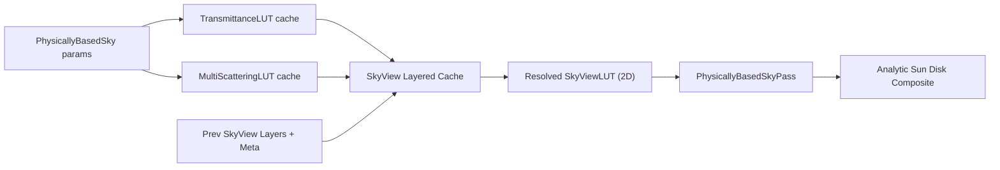

# SkyViewLUT Layered Cache / Reprojection 方案设计稿

## 背景

当前 VividRP 的物理天空链路已经完成了第一轮拆分：

- `TransmittanceLUT` / `MultiScatteringLUT` 已经是按参数缓存的 scene-independent 资源。
- `SkyViewLUT` 仍然是 camera-dependent 的 2D LUT，由 `AtmosphereLUTPass` 生成、`PhysicallyBasedSkyPass` 直接消费。
- 屏幕太阳盘已经从 LUT 中分离，改为在全屏天空着色阶段解析叠加。
- `SkyViewLUT` 当前已经可以区分 `DependenciesChanged` / `ParametersChanged` / `CameraChanged` 三类触发原因。

前一轮把 `SkyViewLUT` 强行朝 HDRP 风格 fixed-reference / distant sky LUT 推进时，已经验证出一个明确问题：

- 目前 VividRP 还没有独立的 `distant atmosphere` / `sky opacity` 链路。
- 在这个前提下直接把 `SkyViewLUT` 改成“远景固定参考点 LUT”，会在高气溶胶密度和地平线附近引入明显回归。

因此，本设计稿的目标不是“立刻照搬 HDRP 的 distant sky LUT”，而是先在 **保持 camera-dependent 语义** 的前提下，给 `SkyViewLUT` 增加更稳妥的 **layered cache / temporal reprojection** 方向。

## 参考 HDRP 的原则

这里参考 HDRP 的不是某个具体实现细节，而是更高层的架构原则：

- 把 scene-independent 的大气预计算和 camera-dependent 的视觉天空分开。
- 视觉天空和环境光照要允许分离，不要求完全共用一套即时结果。
- 视角相关的天空缓存应当优先做“低风险复用”，而不是在链路不完整时直接改成 fixed-reference distant sky。
- 当 `sky color`、`sky opacity`、`aerial perspective` 三条链路还没有一起成立时，不应把远景 LUT 当成当前屏幕天空的唯一来源。

结合当前仓库实现，Phase 1 更适合落地的是：

1. 保留 `SkyViewLUT` 的 camera-dependent 输出契约。
2. 在 `AtmosphereLUTPass` 内部引入更强的 **历史缓存和分层复用**。
3. 把 HDRP 风格 distant sky LUT 留到 `distant atmosphere / sky opacity` 完成后再重新评估。

## 当前实现约束

### 已有能力

- `AtmosphereLUTPass` 已可稳定输出：
  - `TransmittanceLUT`
  - `MultiScatteringLUT`
  - `SkyViewLUT`
- `PhysicallyBasedSkyPass` 当前只依赖一张 `SkyViewLUT` 作为输入。
- 包内已有完整的 history 基础设施：
  - `RenderGraphHistoryRegistry`
  - `RenderGraphBufferHistoryRegistry`
  - `AllocHistoryTexture(...)`
  - `AllocHistoryBuffer(...)`
- `TemporalAAPass` 已经证明：
  - hidden history texture/buffer 的 pass-owned 模式可行
  - 逐帧 previous/current 交换链路可直接复用

### 明确限制

- 当前 `SkyViewLUT` 是**方向域** LUT，而不是屏幕域缓存。
- 当前 `SkyViewLUT` 只表达天空 radiance，不表达独立 sky opacity。
- 当前 `SkyViewLUT` 仍包含地平线/地面贡献，因此地平线区域对缓存误差最敏感。
- 当前还没有必要把 motion vectors 直接引入 `SkyViewLUT`，因为它不是屏幕空间历史。

## 设计目标

### 目标

- 在不修改 `PhysicallyBasedSkyPass` 输入契约的前提下，减少 `SkyViewLUT` 的全量 raymarch 次数。
- 保持当前视觉结果语义，避免再次引入高气溶胶密度下的地平线回归。
- 充分复用仓库已有的 RenderGraph history 机制。
- 为后续 HDRP 风格 distant sky LUT 留出兼容升级路径。

### 非目标

- 本阶段不把 `SkyViewLUT` 改成 fixed-reference distant sky LUT。
- 本阶段不引入新的 `sky opacity` / `distant atmosphere` 视觉链路。
- 本阶段不改 runtime cubemap / ambient probe / specular prefilter 的输入语义。
- 本阶段不把 sky lighting 与 visual sky 的分离问题一起解决。

## 结论：推荐做成“Layered Temporal SkyView Cache”

推荐方向不是单纯的一张 prev/current `SkyViewLUT`，也不是立即改成 HDRP 那种 fixed-reference distant sky，而是：

- 对外仍然输出一张当前帧 `SkyViewLUT`
- 对内维护一个 **N 层的 history texture array + metadata buffer**
- 当前帧从历史层中选择“最接近当前状态”的一个 layer 做 temporal reprojection / reuse
- 然后把重投影结果 resolve 成当前帧的 2D `SkyViewLUT`

这样做的核心好处是：

- 仍然保持 `SkyViewLUT` 的 camera-dependent 语义
- 不依赖尚未实现的 `sky opacity`
- 相比只有单一 prev/current 的时间历史，多 layer 可以显著减少频繁切视角/切高度时的 cache miss
- `PhysicallyBasedSkyPass`、`PhysicallyBasedSkyCommon.hlsl`、天空太阳盘链路都不需要一起大改

## 方案总览



## 资源设计

### 公开资源

保持不变：

- `SkyViewLUT`：`RenderGraphTexture`，2D，给 `PhysicallyBasedSkyPass` 直接读取

### 新增隐藏 history 资源

建议在 `AtmosphereLUTPass` 内新增以下 hidden/pass-owned 资源：

- `SkyViewHistoryLayersPrevious`
  - `RenderGraphTexture`
  - `BindingMode = PassOwnedHidden`
  - `Dimension = TextureDimension.Tex2DArray`
  - `Slices = SkyViewLayerCount`
- `SkyViewHistoryLayersCurrent`
  - `RenderGraphTexture`
  - `BindingMode = PassOwnedHidden`
  - 同上
- `SkyViewHistoryMetaPrevious`
  - `RenderGraphBuffer`
  - `BindingMode = PassOwnedHidden`
- `SkyViewHistoryMetaCurrent`
  - `RenderGraphBuffer`
  - `BindingMode = PassOwnedHidden`

### 推荐初始规格

- `SkyViewLayerCount = 4`
  - 先求稳，不直接上 8 或更多层
  - 192 x 108 x 4 x RGBA16F 的代价可控
- 颜色格式保持 `R16G16B16A16_SFloat`
- metadata buffer 采用固定长度结构化缓冲，每层一条记录

## 元数据设计

每个 layer 对应一条 `SkyViewCacheEntryMeta`：

```csharp
struct SkyViewCacheEntryMeta
{
    uint valid;
    uint dependencyHash;
    uint parameterHash;
    uint lastTouchedFrame;

    float3 cameraPositionPS;
    float padding0;

    float3 sunDirection;
    float padding1;
}
```

### 为什么只存这些字段

- `dependencyHash`
  - 对应 `TransmittanceLUT` / `MultiScatteringLUT` 所依赖的大气基础散射结果
  - 一旦变化，当前 layer 直接视为不兼容
- `parameterHash`
  - 对应 `SkyViewLUT` 自身依赖的非 camera 参数
  - 用于区分“可以直接重用”和“只能低权重引导”
- `cameraPositionPS`
  - 继续沿用现有 `SkyViewLUT` 的 camera-dependent 语义
- `sunDirection`
  - 用于评估时间历史是否仍有足够相似性

当前阶段**不建议**把完整矩阵、运动向量或屏幕投影数据放进 `SkyViewLUT` history meta，因为它不是屏幕域缓存。

## 更新模式

### A. Full Raymarch

以下情况直接全量重建当前 `SkyViewLUT`，并写回一个新 layer：

- history 不存在
- history 尺寸/格式变化
- `dependencyHash` 变化
- 当前没有足够接近的 layer
- 参数变化超出允许阈值
- 首帧 / camera 切换 / graph scope 切换

### B. Reprojection / Reuse

以下情况走 history reprojection：

- `dependencyHash` 一致
- 找到了足够接近当前状态的 layer
- 相机与太阳变化都处于“平滑更新”范围内

这里的 “reprojection” 不是传统屏幕空间 reprojection，而是 **方向域 LUT 的 temporal reuse**：

- 当前 `SkyViewLUT` 的坐标系本来就是方向域
- 对于同一世界方向，UV 本身不需要像屏幕空间 TAA 那样做 motion-vector 回溯
- 因此这个 reprojection 更准确地说，是“沿相同 direction-domain UV 的历史复用 + 当前帧校正”

这也是本方案和屏幕空间 TAA 的最大区别。

## Layer 选择策略

每帧从 `SkyViewHistoryMetaPrevious` 中为当前帧选择一个最佳候选 layer。

### 硬条件

- `valid == 1`
- `dependencyHash` 必须一致

### 评分函数

在满足硬条件后，用以下指标打分：

- `cameraDelta = length(curr.cameraPositionPS - prev.cameraPositionPS)`
- `sunAngleDelta = acos(saturate(dot(curr.sunDirection, prev.sunDirection)))`
- `parameterHash` 是否一致
- `lastTouchedFrame`（用于 LRU）

推荐第一版使用简单分级：

- `parameterHash` 相同 + `cameraDelta` 小 + `sunAngleDelta` 小：高优先级
- `parameterHash` 不同但仍在小阈值内：低优先级，只允许当 bootstrap 引导
- 其余：不选

### 淘汰策略

如果没有任何可用候选，就覆盖最老的 layer（LRU）。

## Reprojection / Resolve 核心逻辑

### 新增 compute kernel

建议在 `AtmosphereLUT.compute` 中新增两个 kernel：

- `SkyViewLUTReproject`
  - 输入：历史 layer、历史 meta、当前参数
  - 输出：当前帧 resolved `SkyViewLUT`
- `SkyViewLUTUpdateLayer`
  - 输入：resolved `SkyViewLUT`
  - 输出：history current 指定 slice

第一版也可以把两步合并成一个 kernel，避免多余带宽。

### 每个 texel 的处理

对当前 `SkyViewLUT` 的每个 direction texel：

1. 从选中的历史 layer 读取 `historyColor`
2. 计算置信度 `confidence`
3. 如果 `confidence` 高：
   - 直接重用或做轻微校正
4. 如果 `confidence` 低：
   - 回退到当前帧 raymarch
5. 输出到当前帧 resolved `SkyViewLUT`

### 置信度建议

推荐初始版本的置信度由以下项组成：

- `cameraDeltaPenalty`
- `sunDeltaPenalty`
- `parameterMismatchPenalty`
- `horizonPenalty`

其中 `horizonPenalty` 很重要：

- 地平线附近是当前链路里最容易出 seam 和回归的位置
- 当 `abs(direction.y)` 很低时，应主动降低 history 权重
- 高气溶胶密度时，这个惩罚应更强

### 太阳盘处理

当前太阳盘已经是解析叠加，因此：

- `SkyViewLUT` history 不需要负责太阳盘 temporal stability
- 这会显著简化 history 复用条件
- 也能避免太阳盘亮斑把 history 污染到邻域

## 推荐的第一版行为

为了降低实现和验证风险，第一版建议：

- 历史重用只作用于 `SkyViewLUT`
- `PhysicallyBasedSkyPass` 保持完全不变
- `SkyViewLUT` 在 history 路径上仍然每帧 dispatch 一次，但：
  - 高置信度 texel 直接复用历史
  - 低置信度 texel 才回退到完整 raymarch

这意味着：

- 结构上已经进入 reprojection / layered cache 路线
- 视觉语义不变
- profiling 上能明显区分“全量重建”和“历史 resolve”
- 不需要一次性引入更激进的 distant sky 重构

## 推荐的阶段化落地顺序

### Step 1：接入 hidden history 资源

目标：

- 在 `AtmosphereLUTPass` 中接入 `SkyViewHistoryLayersPrevious/Current`
- 接入 `SkyViewHistoryMetaPrevious/Current`
- 先只做 history 分配、提交和 layer metadata 管理

验收：

- 即使还没有 reprojection，history 资源也能按 camera scope 稳定存在

### Step 2：实现单候选 layer 的 temporal reuse

目标：

- 先只从最佳 layer 读取
- 做最保守的 confidence 判断
- 失败就直接 full raymarch fallback

验收：

- 静止场景下 `SkyViewLUT` 不再每次都 full raymarch
- 缓慢移动相机时，视觉结果与当前版本一致或更稳定

### Step 3：加入 horizon guard 和高气溶胶保护

目标：

- 在低地平线角度降低 history 权重
- 在高 `aerosol density` / 高 `anisotropy` 条件下降低 history 权重

验收：

- 不重新出现之前的地平线露缝和高气溶胶回归

### Step 4：多 layer 命中策略和 LRU 收敛

目标：

- 不只是单纯 prev/current，而是让 4 层 array 真正发挥作用
- 让高度变化、往返切镜头、时间轴倒回等情况有更高命中率

验收：

- 常见编辑器/运行时镜头切换下，`SkyViewLUT` cache miss 明显减少

## 为什么现在不直接做 HDRP 风格 distant sky LUT

### 原因 1：缺少 sky opacity / distant atmosphere 配套链路

当前 `SkyViewLUT` 只有 radiance，没有配套 sky opacity。

这意味着：

- 无法像 HDRP 一样把“远景天空颜色”和“与场景/雾/地平线过渡相关的部分”明确拆开
- 如果直接改成 fixed-reference distant LUT，当前地平线和高气溶胶区域会再次退化

### 原因 2：当前 `SkyViewLUT` 仍承担一部分地面/地平线贡献

这部分在没有额外 compositing 数据的前提下，不能安全挪走。

### 原因 3：Phase 1 的目标是“先稳住缓存方向”

Phase 1 收尾更应该优先回答：

- 哪些变化真的需要 full raymarch？
- 哪些变化可以只做 history resolve？
- `SkyViewLUT` 的 temporal stability 能否在当前链路下安全成立？

这些问题答完之后，再上 HDRP 风格 distant sky LUT，风险才可控。

## 未来如何升级到 HDRP 风格 distant sky LUT

当以下前置条件成立后，再重新评估 fixed-reference distant sky：

- 独立的 `distant atmosphere` 链路
- 独立的 `sky opacity` 输出
- aerial perspective 与远景天空的 compositing 关系稳定
- 屏幕天空不再依赖 `SkyViewLUT` 承担地平线/地面过渡全部职责

到那时，当前方案里的 history infrastructure 仍然可以保留：

- history texture array 可继续作为 distant sky 的 temporal cache
- metadata buffer 可继续作为 layer 选择依据
- 只是 layer 的语义会从“最近使用的 camera-dependent sky view”转成“固定参考条件下的 distant sky cache”

## 建议新增的 profiling 语义

建议为 `SkyViewLUT` 进一步补这些 profiling 标签：

- `AtmosphereLUTPass.ResolveSkyViewHistory (Bootstrap)`
- `AtmosphereLUTPass.ResolveSkyViewHistory (Reproject)`
- `AtmosphereLUTPass.ResolveSkyViewHistory (FullRaymarchFallback)`
- `AtmosphereLUTPass.UpdateSkyViewLayer (LRUReplace)`

这样可以和当前已有的 `MissingTexture` / `DependenciesChanged` / `ParametersChanged` / `CameraChanged` 一起组成更完整的诊断信息。

## 建议新增的测试点

### EditMode / source tests

- `AtmosphereLUTPass` 声明 hidden history texture/buffer 资源
- `AtmosphereLUTPass` 调用 `AllocHistoryTexture(...)`
- `AtmosphereLUTPass` 调用 `AllocHistoryBuffer(...)`
- `AtmosphereLUT.compute` 声明 `SkyViewLUTReproject`
- `AtmosphereLUT.compute` 声明 layer meta 读写结构

### 行为验证

- history 不可用时会走 bootstrap
- `dependencyHash` 变化时 history 必失效
- `cameraDelta` 小时优先命中已有 layer
- 高气溶胶密度时地平线带 history 权重下降

## 推荐的第一版公开接口策略

不建议第一版就把所有 cache/reprojection 参数暴露到 `SkySettingsVolume`。

建议顺序：

1. 先做内部常量和 profiling
2. 等视觉稳定后，再决定是否暴露：
   - `SkyView Cache Mode`
   - `SkyView Layer Count`
   - `SkyView Reprojection Strength`
   - `SkyView Horizon Guard`

这样可以避免把一个还没验证稳定的实现细节过早固化成 Volume UI。

## 结论

对当前 VividRP 来说，`SkyViewLUT` 最合理的下一步不是“马上 HDRP 化”，而是：

- 先做 **Layered Temporal SkyView Cache**
- 保持对外仍是 camera-dependent 的单张 `SkyViewLUT`
- 用 hidden history texture array + metadata buffer 在 `AtmosphereLUTPass` 内部做多层缓存和 temporal reprojection
- 用更激进的 horizon / aerosol 保护策略，避免历史重用把已知回归重新带回来

这条路的价值在于：

- 能继续推进 Phase 1 的缓存目标
- 不会再次踩到 fixed-reference distant LUT 的已知回归
- 和仓库现有 RenderGraph history / TAA 模式高度兼容
- 为后续真正接入 HDRP 风格 distant sky LUT 保留平滑升级空间

## 参考资料

- Unity HDRP Physically Based Sky: https://docs.unity3d.com/cn/Packages/com.unity.render-pipelines.high-definition%407.4/manual/Override-Physically-Based-Sky.html
- Unity HDRP Environment Lighting: https://docs.unity3d.com/ja/Packages/com.unity.render-pipelines.high-definition%4010.5/manual/Environment-Lighting.html
- Sébastien Hillaire, *A Scalable and Production Ready Sky and Atmosphere Rendering Technique* (2020): https://doi.org/10.1111/cgf.14050
