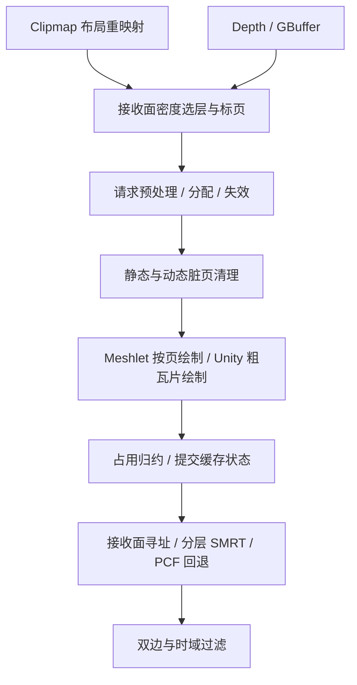

# VSM Shader 与 Unreal 参考关系

审计日期：2026-09-17。VividRP 基线：`038853de`。本文描述当前代码；实施优先级见 [定向光优化路线](../Roadmap~/DirectionalVSMOptimization_20260917.md)。

当日实施更新：分配提交已改为同角色/同层的组内分批并行，保留顺序槽配对；见 [实现与计时](../Temp~/VSM/Roadmap~/Experiments/VSMAllocationCommit_20260917/README.md)。下列当前代码函数位置随本次实现更新。

## 1. 参考范围与使用方式

- 本次参考位于 [Shaders/VirtualShadowMap/ReferenceVSM](../Shaders/VirtualShadowMap/ReferenceVSM/)，共 **37 个 `.usf` / `.ush` 文件**，不含 `.meta`。逐文件 SHA256 与本机 `E:/UnrealEngine/Engine/Shaders/Private/VirtualShadowMaps/` 的同名文件比较，**37/37 相同**。
- 本机 `Engine/Build/Build.version` 为 **5.7.4**，`Changelist=0`、`CompatibleChangelist=47537391`。这是本地引擎元数据及文件一致性确认，不是对官方发行提交的认证。
- 用户已将 `ReferenceVSM` 加入 `.gitignore`。本文链接依赖这份本地参考目录，其他检出需要自行提供该目录；本次未修改参考文件或忽略策略。
- 这些文件依赖目录外的 `Common.ush`、`SceneData.ush`、`BlueNoise.ush`、`Nanite/*`、`InstanceCulling/*`、`/Engine/Shared/*` 等，以及 UE 的 View、GPUScene、Shader permutation 和 C++ 调度。它们不是可独立编译的 Unity Shader 包，也不包含完整 Nanite 光栅器或 UE C++ 缓存生命周期。
- 下文的“对应”表示**功能职责或算法概念对应**，不表示代码移植历史、ABI 兼容或相同画质。函数名为主要检索锚点，行号仅对应本次快照。

## 2. 当前定向光主链路

前半段由 [VSMShadowPass](../Runtime/SubSystem/VirtualShadowMap/RenderPass/VSMShadowPass.cs) 的 `Record`、`RecordReceiverPageRequests`、`DrawVirtualShadowMapPrototypePages` 调度。生成成功后 CSM 跳过图集绘制；VSM 准备/录制失败则走 CSM。

后半段仍由 [CSMShadowResolvePass](../Runtime/RenderPass/Core/CSMShadowResolvePass.cs) 调度。[CSMShadowResolve.compute](../Shaders/Core/Private/CSMShadowResolve.compute) 保留共享资源声明与 **31 个 kernel**，通过 include 引入 VSM 算法。独立 `VSMShadowPass` 已完成，不等于 Resolve 与 Compute 入口也已独立。完整目录边界见 [代码布局](VirtualShadowMapCodeLayout.md)。

## 3. 函数级对应表

### 页面寻址、需求与预算

| 当前 VividRP 入口 | UE 参考入口 | 当前关系与差异 |
|---|---|---|
| [VividVirtualShadowMapAddressing.hlsl](../Shaders/VirtualShadowMap/Public/VividVirtualShadowMapAddressing.hlsl)、[VSMPhysicalSampling.hlsl](../Shaders/VirtualShadowMap/Private/VSMPhysicalSampling.hlsl)：`TryResolveVSMPhysicalTexel`（L82） | [PageAccessCommon](../Shaders/VirtualShadowMap/ReferenceVSM/VirtualShadowMapPageAccessCommon.ush)：`CalcPageOffset`（L192）、`ShadowDecodePageTable`（L272）、`VirtualToPhysicalTexel`（L311） | 均将虚拟纹素映射到物理页。当前页表使用 slot+1 编码，另查 metadata；UE 编码包含有效性/LOD 回退信息。不能共享编码常量。 |
| [VividVirtualShadowMapProjection.hlsl](../Shaders/VirtualShadowMap/Public/VividVirtualShadowMapProjection.hlsl)：`VividVSMProjection`；CPU `VirtualShadowMapProjection` | [ProjectionStructs](../Shaders/VirtualShadowMap/ReferenceVSM/VirtualShadowMapProjectionStructs.ush)：`FVirtualShadowMapProjectionShaderData`（L14）；[Handle](../Shaders/VirtualShadowMap/ReferenceVSM/VirtualShadowMapHandle.ush) | 均提供投影描述。UE 含 translated-world、视图身份、灯光/clipmap 参数；当前是自己的 Matrix4x4/结构化缓冲 ABI，不能复制 UE 字段布局。 |
| [VSMReceiverQuality.hlsl](../Shaders/VirtualShadowMap/Private/VSMReceiverQuality.hlsl)：`SelectVSMDensityLevel`（L27）；[VSMReceiverResolve.hlsl](../Shaders/VirtualShadowMap/Private/VSMReceiverResolve.hlsl)：`VSMMarkReceiverPages`（L380）；`MarkVSMReceiverPage` | [PageMarking.ush](../Shaders/VirtualShadowMap/ReferenceVSM/VirtualShadowMapPageMarking.ush)：`GetBiasedClipmapLevel`（L18）、`MarkPageDirectional`（L139）；[PageMarking.usf](../Shaders/VirtualShadowMap/ReferenceVSM/VirtualShadowMapPageMarking.usf)：`GeneratePageFlagsFromPixels`（L325） | 已有当帧接收面请求、密度选层、请求角色、滤波/射线 footprint 扩张。UE 还有 receiver mask、局部灯和 froxel/coarse 请求。不能把 UE 局部灯 mip 直接对应定向光 clipmap。 |
| [VSMPageDefinitions.hlsl](../Shaders/VirtualShadowMap/Private/VSMPageDefinitions.hlsl)：`VSMPageRequestPriority`（L25）；[VSMPageManagement.hlsl](../Shaders/VirtualShadowMap/Private/VSMPageManagement.hlsl)：`VSMPrototypePrepareAllocation`（L427）、`VSMPrototypeAllocatePages`（L479） | [PhysicalPageManagement](../Shaders/VirtualShadowMap/ReferenceVSM/VirtualShadowMapPhysicalPageManagement.usf)：`UpdatePhysicalPages`（L227）、`AllocateNewPageMappings`（L425）、`AllocateNewPageMappingsCS`（L621）、`PackAvailablePages`（L636）、`AppendPhysicalPageLists`（L682）；[PerPageDispatch](../Shaders/VirtualShadowMap/ReferenceVSM/VirtualShadowMapPerPageDispatch.ush)：`FPerPageDispatchSetup` | 当前预处理、候选排序、同角色/同层请求压缩及映射提交已并行；**lane 0 保留顺序槽配对**，仍是单组分批处理。UE 使用物理页列表、原子 push/pop 与按页调度。借鉴分阶段列表机制，保留当前粗层保障、角色优先级和稳定淘汰规则。 |
| [VSMPageManagement.hlsl](../Shaders/VirtualShadowMap/Private/VSMPageManagement.hlsl)：`UpdateVSMPagePressure`（L307） | [Throttle](../Shaders/VirtualShadowMap/ReferenceVSM/VirtualShadowMapThrottle.usf)：`ProcessPrevFramePerfDataCS`（L28）、`UpdateThrottleParametersCS`（L91） | 都可调节分辨率 bias，**控制信号不同**。当前以请求产生、后续帧消费的 essential 需求/缺页与失败恢复边界控制，另记录细层驻留统计；UE 此文件使用 Nanite HW/SW cluster 成本启发式或动态分辨率压力，再做全局/每灯平滑。不能称当前为 UE Throttle 的等价实现。 |

### 缓存、清页与 caster 绘制

| 当前 VividRP 入口 | UE 参考入口 | 当前关系与差异 |
|---|---|---|
| [VSMPageManagement.hlsl](../Shaders/VirtualShadowMap/Private/VSMPageManagement.hlsl)：`VSMResetPhysicalOwners`（L392）、`VSMRemapPages`（L399）；CPU `VirtualShadowMapClipmapLayout` | [PhysicalPageManagement](../Shaders/VirtualShadowMap/ReferenceVSM/VirtualShadowMapPhysicalPageManagement.usf)：`UpdatePhysicalPageAddresses`（L155）、`UpdatePhysicalPages`（L227） | 复用滚动后的页面地址/内容，维护 owner 与页表。UE 的 view/light 身份和缓存生命周期还依赖 C++，本目录不足以还原完整调度。 |
| [VSMPageManagement.hlsl](../Shaders/VirtualShadowMap/Private/VSMPageManagement.hlsl)：`InvalidateVSMPageBounds`（L714）、`VSMPrototypeInvalidateDynamicPages`（L813）；CPU `BuildDynamicInvalidationBounds`、`CommitDynamicUnityBounds` | [CacheInvalidation](../Shaders/VirtualShadowMap/ReferenceVSM/VirtualShadowMapCacheInvalidation.ush)：`InvalidateInstancePages`（L41）；[CacheGPUInvalidation](../Shaders/VirtualShadowMap/ReferenceVSM/VirtualShadowMapCacheGPUInvalidation.usf)：`VSMUpdateViewInstanceStateCS`（L66）、`ProcessInvalidationQueueGPUCS`（L151）；[CacheLoadBalancer](../Shaders/VirtualShadowMap/ReferenceVSM/VirtualShadowMapCacheLoadBalancer.usf)：`InvalidateInstancePagesLoadBalancerCS`（L28） | Meshlet 已有旧/新 bounds journal。Unity 普通 MeshRenderer 使用旧/新**聚合 bounds**，当前覆盖仍每帧刷新；动态矩形失效已组内 64 线程并行。UE 还有 instance/view 状态与队列负载分配。当前还不是逐 Renderer 静止检测。 |
| CPU [VirtualShadowMapUnityCasterCompatibility](../Runtime/SubSystem/VirtualShadowMap/VirtualShadowMapUnityCasterCompatibility.cs)，ShadowCaster tag `VividVSMConservativeBounds=1` | [PageCacheCommon](../Shaders/VirtualShadowMap/ReferenceVSM/VirtualShadowMapPageCacheCommon.ush)：`ShouldMaterialInvalidateShadowCache`（L11）、`ShouldCacheInstanceAsStatic`（L84） | 均需约束形变、材质和静动态状态。当前未支持的 Skinned/Terrain/粒子/自定义形变保守全刷；UE WPO 策略依赖 GPUScene 更新通知，不能只复制判断式就停止失效。 |
| [VSMPageManagement.hlsl](../Shaders/VirtualShadowMap/Private/VSMPageManagement.hlsl)：`VSMBuildPageWorkLists`（L826）、`VSMClearPhysicalPagesIndirect`（L902）、`VSMReducePageOccupancyIndirect`（L987）、`VSMPrototypeFinalizeDirtyPages`（L908） | [PhysicalPageManagement](../Shaders/VirtualShadowMap/ReferenceVSM/VirtualShadowMapPhysicalPageManagement.usf)：`SelectPagesToInitializeCS`（L797）、`InitializePhysicalPagesIndirectCS`（L900）、`SelectPagesToMergeCS`（L929）、`SelectPagesForHZBAndUpdateDirtyFlagsCS`（L1030） | 已生成脏页/脏或未知占用页两份紧凑列表，间接清页与归约；清完整双池 16 层，finalize 仍全虚拟页扫描。对应 UE 先选页再处理纹素的结构；不能照搬单层 merge/HZB。计时与稳定性边界见 [工作列表报告](../Temp~/VSM/Roadmap~/Experiments/VSMPageWorkLists_20260917/README.md)。 |
| [VSMPageManagement.hlsl](../Shaders/VirtualShadowMap/Private/VSMPageManagement.hlsl)：`VSMPrototypePrepareMeshletPageRequests`（L60）、`VSMPrototypeCullMeshletsToPages`（L202）；[VisibilityBufferShadowCasterPass.shader](../Shaders/Core/Private/GPUDriven/VisibilityBufferShadowCasterPass.shader) | [BuildPerPageDrawCommands](../Shaders/VirtualShadowMap/ReferenceVSM/VirtualShadowMapBuildPerPageDrawCommands.usf)：`CullPerPageDrawCommandsCs`（L153）、`AllocateCommandInstanceOutputSpaceCs`（L456）、`OutputCommandInstanceListsCs`（L487）；[PageOverlap](../Shaders/VirtualShadowMap/ReferenceVSM/VirtualShadowMapPageOverlap.ush)：`OverlapsAnyValidPage`（L78/L146） | 已有 Meshlet-page 请求、按 clipmap 分组的大范围请求和间接绘制。UE 进一步利用层级页 flags、receiver mask、批次/实例负载分配。当前“已有按页绘制”，剩余问题是候选遍历、冗余覆盖和跨 clipmap 扩展性。 |
| [VSMShadowPass.cs](../Runtime/SubSystem/VirtualShadowMap/RenderPass/VSMShadowPass.cs)：`DrawVirtualShadowMapPrototypePages` 内 Unity 粗瓦片循环（约 L1260–1320） | [CompactViews](../Shaders/VirtualShadowMap/ReferenceVSM/VirtualShadowMapCompactViews.usf)：`CompactViewsVSM_CS`（L40）；[ComputeExplicitChunkDrawsViewMask](../Shaders/VirtualShadowMap/ReferenceVSM/VirtualShadowMapComputeExplicitChunkDrawsViewMask.usf)：`ComputeExplicitChunkDrawsViewMask`（L12） | UE 剔除没有 uncached page rect 的 view/mip，再更新工作视图 mask。当前 Unity 仍逐粗瓦片创建/执行 Shadow RendererList；借鉴“有工作才提交”，但 UE Nanite view 不能直接套到 Unity RendererList。 |
| [VividVirtualShadowMapCaster.hlsl](../Shaders/VirtualShadowMap/Public/VividVirtualShadowMapCaster.hlsl)：`VividInsertVSMDepth`（L66）、`VividWriteVSMPageDepth`（L99） | 此目录**没有多层插入的直接对应**；[PageAccessCommon](../Shaders/VirtualShadowMap/ReferenceVSM/VirtualShadowMapPageAccessCommon.ush) 只对应寻址部分 | 当前两池各保留 16 个不同深度，逐层 `InterlockedMax` 搬移被挤出的值。UE 的实际 caster/Nanite 光栅写入还在此目录外。`ShadowCasterBounds.usf`、`ShadowCasterColor.usf` 是可视化，不能用作生产深度写入的参考。 |

### 阴影求值、SMRT 与过滤

| 当前 VividRP 入口 | UE 参考入口 | 当前关系与差异 |
|---|---|---|
| [VSMReceiverNormal.hlsl](../Shaders/VirtualShadowMap/Private/VSMReceiverNormal.hlsl)：`ReconstructVSMReceiverNormal`；[VSMReceiverResolve.hlsl](../Shaders/VirtualShadowMap/Private/VSMReceiverResolve.hlsl)：`BuildVSMReceiverBias`（L1）、`TryEvaluateVSMProjection`（L188）、`ResolveVSMReceiverMode`（L265） | [Projection.usf](../Shaders/VirtualShadowMap/ReferenceVSM/VirtualShadowMapProjection.usf)：`GetEstimatedGeoWorldNormal`（L110）、`ProjectLight`（L174）、`VirtualShadowMapProjection`（L774）；[ProjectionCommon](../Shaders/VirtualShadowMap/ReferenceVSM/VirtualShadowMapProjectionCommon.ush)：`SampleVirtualShadowMapDirectional`（L423）；[ProjectionDirectional](../Shaders/VirtualShadowMap/ReferenceVSM/VirtualShadowMapProjectionDirectional.ush)：`ComputeDepthSlopeDirectionalUV`（L16）、`GetMappedClipmap`（L38） | 同属接收面构造、偏移、选层和求值。当前会检查完整 footprint，尝试层级并在 SMRT 不可用后重试 PCF；UE 起点找 mapped clipmap，SMRT 样本还能跨 clipmap 查找。缺页/不可用语义需要分别保留。 |
| [VSMSMRT.hlsl](../Shaders/VirtualShadowMap/Private/VSMSMRT.hlsl)：`TryTraceVSMSMRTRay`（L124）、`TryTraceVSMSMRTClipmaps`（L256）、`VSMSMRTHasDepthInInterval`（L96） | [ProjectionDirectional](../Shaders/VirtualShadowMap/ReferenceVSM/VirtualShadowMapProjectionDirectional.ush)：`SMRTClipmapRayInitialize`（L84）、`SMRTFindSample`（L124）；[SMRTTemplate](../Shaders/VirtualShadowMap/ReferenceVSM/VirtualShadowMapSMRTTemplate.ush)：`SMRTRayCast`（L26） | 当前是有预算的纹素格 DDA、多层区间查询与有限单格 gap fill；隐藏层二分已按原顺序固定四步展开，见[计时与等价验证](../Temp~/VSM/Roadmap~/Experiments/SMRTBinaryUnroll_20260918/README.md)。UE 是首层深度、平方分布步点与深度历史/斜率外推。当前每个 clipmap 段有预算，末级可扩展，因此“4 rays × 8 samples”不是最多 32 次读取。 |
| [VSMSMRT.hlsl](../Shaders/VirtualShadowMap/Private/VSMSMRT.hlsl)：`VSMSMRTPhase`（L60）、`VSMSMRTProgressiveSample`（L69）、`TryFilterVSMSMRT`（L303） | [SMRTCommon](../Shaders/VirtualShadowMap/ReferenceVSM/VirtualShadowMapSMRTCommon.ush)：`VirtualShadowMapGetRandomSample`（L44）、`GetSMRTTraceSettingsDirectional`（L77）；[ProjectionDirectional](../Shaders/VirtualShadowMap/ReferenceVSM/VirtualShadowMapProjectionDirectional.ush)：`TraceDirectional`（L175） | 当前使用蓝噪声 phase + 与最终预算无关的渐进前缀；UE 用 R2 偏移获取蓝噪声维度。UE 射线长度随视点距离缩放；当前跨 clipmap 保持原射线与配置的世界长度，不能直接替换长度公式。 |
| `VSMReceiverResolve::PrepareVSMReceiverProjection`、`VSMReceiverQuality::SelectVSMDensityLevelPrepared`、`VSMSMRT::PrepareVSMSMRTProjection/PrepareVSMSMRTReceiverSamples` | [ProjectionDirectional](../Shaders/VirtualShadowMap/ReferenceVSM/VirtualShadowMapProjectionDirectional.ush)：`TraceDirectional` 循环前准备投影、斜率和接收点 | 已共享选层接受的投影与坐标、接收点随机相位，以及 ray 的起始投影参数。粗层仍保留独立滚动变换和完整 footprint，不改变多层 DDA。见[准备复用报告](../Temp~/VSM/Roadmap~/Experiments/SMRTReceiverPreparation_20260918/README.md)。 |
| [VSMSMRT.hlsl](../Shaders/VirtualShadowMap/Private/VSMSMRT.hlsl)：`VSMWaveCanFinish`（L291）、生产 overload（L347） | [ProjectionDirectional](../Shaders/VirtualShadowMap/ReferenceVSM/VirtualShadowMapProjectionDirectional.ush)：`TraceDirectional` 内 compute adaptive 循环 | UE 第一条 ray 全 wave miss 可结束；随后到达 `AdaptiveRayCount` 门槛，全 wave 累计 miss 数为零可结束，并按实际 ray 数归一。当前已通过独立 `VSMShadowResolveAdaptive` 生产入口接通，暗区门槛取零基索引 1；固定预算仍使用原入口。缺页/失败 lane 会禁止该次估计提前退出，开关不依赖历史。见[生产接线报告](../Temp~/VSM/Roadmap~/Experiments/SMRTAdaptiveProduction_20260918/README.md)。 |
| [VSMFiltering.hlsl](../Shaders/VirtualShadowMap/Private/VSMFiltering.hlsl)：`LoadVSMHistory`（L21）、`VSMShadowTemporalV`（L64） | [ProjectionFilter](../Shaders/VirtualShadowMap/ReferenceVSM/VirtualShadowMapProjectionFilter.ush)：`FilterVirtualShadowMapSampleResult`（L12）仅添加抖动；[ProjectionComposite](../Shaders/VirtualShadowMap/ReferenceVSM/VirtualShadowMapProjectionComposite.usf) 输出衰减/解码 mask | **不存在直接对应的双边+时域降噪实现。** 当前按相机 VP、深度/法线验证历史；不能从这份参考包推出 UE TSR/运动矢量管线的完整行为。共享入口中的 Bend 也不等同 UE `VirtualShadowMapScreenRayCast` 起点处理。 |

## 4. 37 个参考文件的阅读索引

以下清单覆盖全部参考 Shader。上表展开关键函数，本节标明其用途，避免把外围功能列为定向光主链路缺口。

| 分组 | 文件与用途 |
|---|---|
| 身份与投影（2） | [VirtualShadowMapHandle.ush](../Shaders/VirtualShadowMap/ReferenceVSM/VirtualShadowMapHandle.ush)：VSM 身份；[VirtualShadowMapProjectionStructs.ush](../Shaders/VirtualShadowMap/ReferenceVSM/VirtualShadowMapProjectionStructs.ush)：投影数据读取。 |
| 标页与页表（6） | [VirtualShadowMapPageAccessCommon.ush](../Shaders/VirtualShadowMap/ReferenceVSM/VirtualShadowMapPageAccessCommon.ush)：寻址；[VirtualShadowMapPageMarking.ush](../Shaders/VirtualShadowMap/ReferenceVSM/VirtualShadowMapPageMarking.ush)：标页辅助；[VirtualShadowMapPageMarking.usf](../Shaders/VirtualShadowMap/ReferenceVSM/VirtualShadowMapPageMarking.usf)：pixel/froxel/coarse 需求；[VirtualShadowMapPageManagement.usf](../Shaders/VirtualShadowMap/ReferenceVSM/VirtualShadowMapPageManagement.usf)：层级 flags、receiver mask 与 mapped mip 传播；[VirtualShadowMapPerPageDispatch.ush](../Shaders/VirtualShadowMap/ReferenceVSM/VirtualShadowMapPerPageDispatch.ush)：页遍历；[VirtualShadowMapPhysicalPageManagement.usf](../Shaders/VirtualShadowMap/ReferenceVSM/VirtualShadowMapPhysicalPageManagement.usf)：物理分配、选页、清理、合并、HZB。 |
| 缓存失效（4） | [VirtualShadowMapPageCacheCommon.ush](../Shaders/VirtualShadowMap/ReferenceVSM/VirtualShadowMapPageCacheCommon.ush)：缓存/WPO 条件；[VirtualShadowMapCacheInvalidation.ush](../Shaders/VirtualShadowMap/ReferenceVSM/VirtualShadowMapCacheInvalidation.ush)：实例覆盖失效；[VirtualShadowMapCacheGPUInvalidation.usf](../Shaders/VirtualShadowMap/ReferenceVSM/VirtualShadowMapCacheGPUInvalidation.usf)：GPU 状态/队列；[VirtualShadowMapCacheLoadBalancer.usf](../Shaders/VirtualShadowMap/ReferenceVSM/VirtualShadowMapCacheLoadBalancer.usf)：失效工作分摊。 |
| 绘制调度（4） | [VirtualShadowMapPageOverlap.ush](../Shaders/VirtualShadowMap/ReferenceVSM/VirtualShadowMapPageOverlap.ush)：页/mask/HZB 测试；[VirtualShadowMapBuildPerPageDrawCommands.usf](../Shaders/VirtualShadowMap/ReferenceVSM/VirtualShadowMapBuildPerPageDrawCommands.usf)：实例命令；[VirtualShadowMapCompactViews.usf](../Shaders/VirtualShadowMap/ReferenceVSM/VirtualShadowMapCompactViews.usf)：有效 view/mip 压缩；[VirtualShadowMapComputeExplicitChunkDrawsViewMask.usf](../Shaders/VirtualShadowMap/ReferenceVSM/VirtualShadowMapComputeExplicitChunkDrawsViewMask.usf)：工作组 view mask。 |
| 投影/SMRT（8） | [VirtualShadowMapProjection.usf](../Shaders/VirtualShadowMap/ReferenceVSM/VirtualShadowMapProjection.usf)：求值入口；[VirtualShadowMapProjectionCommon.ush](../Shaders/VirtualShadowMap/ReferenceVSM/VirtualShadowMapProjectionCommon.ush)：采样/偏移；[VirtualShadowMapProjectionDirectional.ush](../Shaders/VirtualShadowMap/ReferenceVSM/VirtualShadowMapProjectionDirectional.ush)：定向光；[VirtualShadowMapSMRTCommon.ush](../Shaders/VirtualShadowMap/ReferenceVSM/VirtualShadowMapSMRTCommon.ush)：随机数/配置；[VirtualShadowMapSMRTTemplate.ush](../Shaders/VirtualShadowMap/ReferenceVSM/VirtualShadowMapSMRTTemplate.ush)：步进/外推；[VirtualShadowMapScreenRayTrace.ush](../Shaders/VirtualShadowMap/ReferenceVSM/VirtualShadowMapScreenRayTrace.ush)：屏幕射线起点；[VirtualShadowMapProjectionFilter.ush](../Shaders/VirtualShadowMap/ReferenceVSM/VirtualShadowMapProjectionFilter.ush)：抖动；[VirtualShadowMapProjectionComposite.usf](../Shaders/VirtualShadowMap/ReferenceVSM/VirtualShadowMapProjectionComposite.usf)：合成。 |
| 质量成本控制（1） | [VirtualShadowMapThrottle.usf](../Shaders/VirtualShadowMap/ReferenceVSM/VirtualShadowMapThrottle.usf)：成本启发式驱动 LOD bias，可用于后续补充预算控制。 |
| 局部灯/材质扩展（4） | [VirtualShadowMapProjectionSpot.ush](../Shaders/VirtualShadowMap/ReferenceVSM/VirtualShadowMapProjectionSpot.ush)：局部灯投影/SMRT；[VirtualShadowMapLightGrid.ush](../Shaders/VirtualShadowMap/ReferenceVSM/VirtualShadowMapLightGrid.ush)：灯光网格；[VirtualShadowMapMaskBitsCommon.ush](../Shaders/VirtualShadowMap/ReferenceVSM/VirtualShadowMapMaskBitsCommon.ush)：多灯 packed mask；[VirtualShadowMapTransmissionCommon.ush](../Shaders/VirtualShadowMap/ReferenceVSM/VirtualShadowMapTransmissionCommon.ush)：透射/次表面辅助。当前定向光性能优化不以补齐这些功能为前提。 |
| 统计（3） | [VirtualShadowMapStats.ush](../Shaders/VirtualShadowMap/ReferenceVSM/VirtualShadowMapStats.ush)：统计辅助；[VirtualShadowMapCopyStats.usf](../Shaders/VirtualShadowMap/ReferenceVSM/VirtualShadowMapCopyStats.usf)：复制统计；[VirtualShadowMapPrintStats.usf](../Shaders/VirtualShadowMap/ReferenceVSM/VirtualShadowMapPrintStats.usf)：输出统计。对应当前 GPU counters、`VSMProfiling` 和实验归档，不能取代 GPU 时间戳。 |
| 可视化（5） | [VirtualShadowMapDebug.usf](../Shaders/VirtualShadowMap/ReferenceVSM/VirtualShadowMapDebug.usf)：页/clipmap 调试；[VirtualShadowMapVisualize.ush](../Shaders/VirtualShadowMap/ReferenceVSM/VirtualShadowMapVisualize.ush)：caster 调试参数；[VirtualShadowMapShadowCasterBounds.usf](../Shaders/VirtualShadowMap/ReferenceVSM/VirtualShadowMapShadowCasterBounds.usf)：bounds 绘制；[VirtualShadowMapShadowCasterColor.usf](../Shaders/VirtualShadowMap/ReferenceVSM/VirtualShadowMapShadowCasterColor.usf)：caster 着色可视化；[Desaturate.usf](../Shaders/VirtualShadowMap/ReferenceVSM/Desaturate.usf)：调试背景去饱和。对应当前 `VSMDebug.shader` / `VSMReceiverDebug.hlsl` 的诊断职责。 |

## 5. 借鉴时必须保留的表示差异

1. **完整双池 16 层。** 每物理页每池 `128 × 128 × 16 × 4 = 1 MiB`，1024 页双池深度数据本身为 **2 GiB**，不含其他资源。清页/插入成本应从少做无效工作入手；减层会改变隐藏遮挡能力，不能算等价优化。
2. **两池的层序独立。** UE `MergePhysicalPixel` 用 `max(static, dynamic)` 合并最前深度；对当前每个相同 layer rank 做 max 会丢失另一池的隐藏表面。不能直接推广到 16 层。
3. **首层 HZB 不能证明隐藏 caster 无用。** UE `IsPageVisibleHZB` 和 `BuildHZBPerPage*` 可供理解调度；剔掉首层后面的几何会破坏分层 SMRT。可先借鉴页需求/空池/保守深度范围证明，不能把单层遮挡测试当作保质量替代。
4. **采样的少工作不等于同结果。** UE 首 ray 全 miss 只是当帧自适应启发式，不证明完整 ray 集合全亮。重启此优化必须区分深度存储等价、固定 ray 求交等价、自适应噪声/偏差和重载稳定性。
5. **省略 CPU 或外部 Shader 依赖会误判完成度。** 大世界坐标、每视图缓存身份、GPUScene 生命周期、Nanite 光栅和最终时域重建都不能仅凭这 37 个文件移植完成。

本轮只做本地源码、快照和历史证据审计，未运行新的 GPU 计时、Unity 测试或 Shader 编译；没有修改渲染实现。

SMRT 内部工作量现可通过 [smrt-cost 诊断](SMRTCostDiagnostics.md) 分别统计 footprint、DDA、双池分层读取、过渡与回退；[2026-09-17 实测](../Temp~/VSM/Roadmap~/Experiments/SMRTCost_20260917/README.md) 记录了与 GPU 阶段时间的区别。

## 定向光 SMRT 调用方式的后续对齐

具体参数、采样预算、跨层寻址和 wave 提前退出差异见 [2026-09-18 对齐方案](../Roadmap~/SMRTUsageAlignment_20260918.md)。其中对齐调用与准备复用可继续保留完整多层求交；UE 式固定步点/视距长度属于需单独验收的质量变化。

## 固定步数与视距长度的独立验证（2026-09-18）

已完成[实验报告](../Temp~/VSM/Roadmap~/Experiments/SMRTFixedStepsViewLength_20260918/README.md)：借鉴 `SMRTRayCast` 的平方步点和 `TraceDirectional` 的视距长度，保留完整静态/动态隐藏层查询。实验为保留现有平行尾段增加一个端点，最多 N+2 次位置查询；不是 UE 的 N+1 或完整单深度历史外推实现。两项均有明显图像偏差，代码仅保存在实验目录，生产仍使用多层 DDA 和固定最大世界长度。

## 多层 DDA 保守区间研究（2026-09-18）

[独立实验](../Temp~/VSM/Roadmap~/Experiments/SMRTConservativeIntervals_20260918/README.md) 使用物理块深度摘要证明查询区间无命中，保留完整层、补洞、尾段与逐格浮点推进；这是针对当前多层 DDA 的研究方案。合成和实景对照均零差异，但固定/自适应查询均变慢，未接入生产。报告记录了前层摘要与全层摘要的不同证明能力，以及脏页归约和物理槽有效期要求。

## 长段与深度区间掩码验证（2026-09-18）

[后续实验](../Temp~/VSM/Roadmap~/Experiments/SMRTDepthMaskLongSegments_20260918/README.md) 使用 8×8 块的完整双池 64 位局部深度掩码，保留层间空隙；同时验证 2/4/8 格触发门槛。合成和三轮实景质量对照均零差异，受控长段微基准有收益，但当前场景无 ≥8 格段，实景查询均回归，未接入生产。局部 `precise` 对共享上游算术的影响已通过关闭门控对照隔离，最终版采用向外扩张的证据界限。
