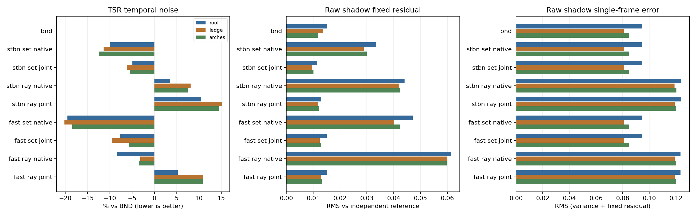
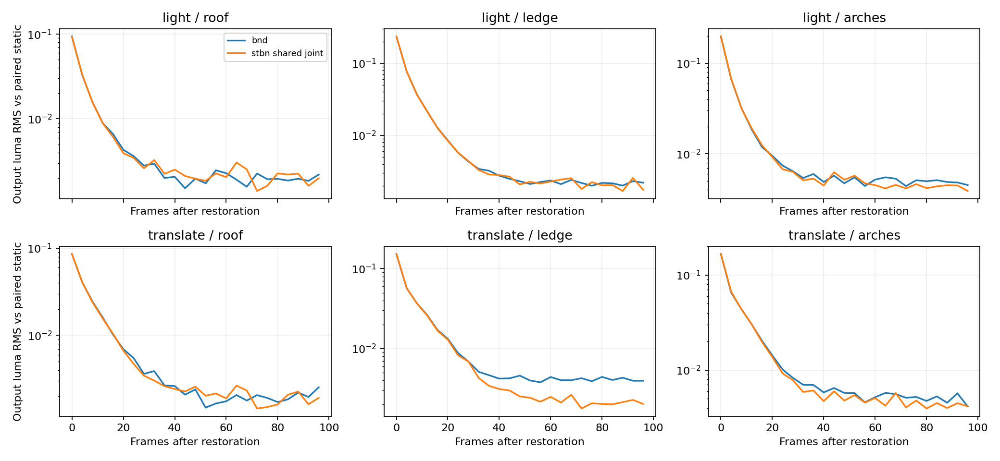

# 4096 / 4×8：逐射线采样与 TSR jitter 联合序列验证

结论：**本轮最有价值的改动是解除图集切片与 TSR jitter 的短周期锁定；当前逐射线分别取样方案未通过质量对照。** STBN 共享相位＋联合帧序的固定残差相对 BND 降低 14%–29%，反向顺序复测得到同样结果。最终 TSR 闪动只得到小幅改善，复测降幅为 0.6%–2.7%。光照与相机恢复未观察到变慢。

本轮为验证实验。运行时代码、着色器和场景设置已恢复；生产默认仍为 BND。诊断补丁与捕获脚本保留在本目录，未将候选推广为默认设置。

## 实际执行范围

基线提交 `caa227a5`，Unity 6000.7.0a6，项目 `E:/VividRP_Reborn`。9 组静态各记录 512 帧，共 4608 帧；候选与 BND 反向顺序重复静态，再做两组光照阶跃和两组相机移动，各 544 帧，共 3264 帧。两次运行另有各 16 帧 priming，未纳入正式样本。每组至少预热 512 帧，实际记录中的 warmFrames 为 513–519。

固定条件：VSM 4096、SMRT 4 rays × 8 steps、光源角直径 7.1°、最大射线长度 10、过渡带 0.2；启用屏幕密度选层，目标 1 texel/pixel、LOD bias 0、PCF 开启。原生 1920×1080、TSR jitter 8 相位、history 16、sharpen 0.483；局部历史裁剪、最终混合、曝光、DDA 和深度偏移保持相同。实际输出按 native capture 分析，不使用 Game 面板缩放图测量。

**实验物理页池为 512，生产上限为 256。** 所有正式捕获均 Active，overflow=0、missing=0。这隔离了页面不足的干扰，也意味着本结论尚不能直接代表生产页池压力下的收益。大量 GPU readback、压缩及诊断 dispatch 存在，本轮不提供 GPU 性能结论。

## 联合序列与逐射线映射

只使用已下载的公开 RG8 vec2 图集：NVIDIA STBN 128×128×64、EA FAST Gaussian Separate 128×128×32。保留 RG 配对，以 `Texture2DArray.Load` 点读取，线性数据，无 mip、插值或重生成。资源版本、SHA256 和许可证见 `texture-provenance.json`、`stbn-license.txt`、`fast-license.txt`。没有调用 FastNoise 或生成替代图集。

以 f 为本组采样帧计数、D 为图集深度：

```text
native slice = f % D
joint  slice = (f + floor(f / 8)) % D
```

| 序列 | 每个固定 TSR jitter 相位可访问的不同切片数 | 联合重复周期 |
|---|---:|---:|
| BND，原有 256 帧采样序列 | 32 个采样索引 | 256 帧 |
| STBN native | 8 / 64 | 64 帧 |
| STBN joint | 64 / 64 | 512 帧 |
| FAST native | 4 / 32 | 32 帧 |
| FAST joint | 32 / 32 | 256 帧 |

固定 jitter 相位下，joint 的切片步长为 9，与 64/32 互质，因此能均匀遍历所有切片。CPU 审计与实际 GPU 帧记录中的 jitter/atlasSlice 均验证了这点；没有修改 TSR jitter 本身。该公式每 8 帧多前进一步，**有意改变原生图集的时间邻接关系**，不能宣称仍完整保留原生 STBN 的时间频谱性质，也不是 Unreal 实现的源码复刻。当前公式只验证了 8 相位配置。

shared：每个接收点/投影共享两对 RG，分别作为圆盘方向和 receiver origin 的相位。ray：射线 r 使用第 2r 和 2r+1 对，固定空间偏移为 `floor(128 * frac(pairIndex * (0.754877666, 0.569840296)))`。四条射线使用八个不同偏移；空间平移不等同于统计独立维度。

逐射线分支保留径向分层、golden-angle 项、receiver Hammersley 映射、texel-center 量化、DDA、长度限制及厚度处理，只把共享的相位换成分别取样的相位。它削弱了四条射线之间原有的角向/receiver 集合协调；这解释了单帧方差上升的可能机制，但本轮未单独测量每种协方差贡献。结论针对这一分支，不能推广成“所有逐射线 STBN 都无效”。诊断补丁中的 scalar/reference 分支来自既有工具，9 组实际测试未启用它们。

## 静态结果

区域依次为 roof / ledge / arches。固定残差：每个 jitter 相位的 raw visibility 均值相对独立参考的 RMS，使用完整 512 帧周期。TSR 闪动：最终输出亮度减去同 jitter 相位均值后的 RMS；下表采用排除前 32 帧后的 480 帧敏感性窗口。负数表示较 BND 改善。

| 变体 | 固定残差变化：屋檐 / 横檐 / 拱门 | TSR 闪动变化：屋檐 / 横檐 / 拱门 |
|---|---|---|
| bnd | +0.0% / +0.0% / +0.0% | +0.0% / +0.0% / +0.0% |
| stbn_shared_native | +120.4% / +111.7% / +151.8% | -10.2% / -11.7% / -12.8% |
| stbn_shared_joint | -24.5% / -29.2% / -14.4% | -5.0% / -6.5% / -5.7% |
| stbn_ray_native | +190.5% / +208.4% / +255.6% | +3.2% / +7.7% / +7.1% |
| stbn_ray_joint | -14.2% / -13.1% / +1.6% | +10.3% / +14.7% / +14.1% |
| fast_shared_native | +211.0% / +193.9% / +255.5% | -19.8% / -20.6% / -18.8% |
| fast_shared_joint | -0.4% / -9.2% / +10.2% | -7.9% / -9.8% / -5.9% |
| fast_ray_native | +305.8% / +338.8% / +402.4% | -8.7% / -3.6% / -3.9% |
| fast_ray_joint | +0.3% / -4.5% / +12.0% | +5.1% / +10.6% / +10.5% |

原始 512 帧窗口的完整统计见 `static/decision.json`、`static/summary.json`；排除前 32 帧的统计见 `static/tail-temporal.json`。两种窗口的排序一致，说明首次结果不是只由开头的历史重置瞬态造成。



STBN shared joint 相对 native 的固定残差降低约 66%，相对 BND 降低约 14%–29%。native 方案有些看起来更“稳定”，同时却留下更大的固定误差，单看时间方差会误选。逐射线 joint 的最终噪声则增加约 10%–15%，raw 单帧误差也明显增大。FAST shared joint 的拱门固定残差较 BND 增加约 10%，未优于 STBN 候选的综合结果。

反向顺序复测先跑 STBN shared joint，再跑 BND；各记录 544 帧，取 32–543 的完整 512 帧周期：

| 指标，相对 BND | 屋檐 | 横檐 | 拱门 |
|---|---:|---:|---:|
| 固定残差 | -24.54% | -29.21% | -14.45% |
| 最终 TSR 闪动 | -2.74% | -0.81% | -0.64% |

固定残差可靠复现；最终 TSR 的改善随轮次减小，主要来自重复 BND 组自身输出 RMS 下降。首轮相同尾窗口仍有约 5%–6% 的降幅，所以不能将轮次差异仅归因于排除启动帧。绝对 cameraFrame 在各组之间不同；实际 jitter、GPU VP 和 SMRT shaderFrameSeed 匹配，但未证明其他时域状态完全一致。因此以复测中较小的 0.6%–2.7% 作为保守描述，不承诺稳定的 5%–6% 视觉收益。

参考使用上一轮每 jitter 1024 个独立四维相位估计，积分的是同一 4×8 SMRT 估计器，不是几何真值。参考半样本误差 RMS 为约 0.00297 / 0.00253 / 0.00266；分别使用两半参考时，候选固定残差仍降低约 13.5%–28.3%。未把参考不确定性从结果中静默扣除。

复用参考前核对相机、GPU VP、jitter、分辨率、偏移、光源与射线设置。新 BND 的稳定帧 256/287 与旧参考相应采样帧 raw shadow 完全一致。首帧有少量差异，ROI 最大差值 0.25；首尾 256 帧重复周期中仅 2 对帧存在差异，对完整均值的影响 RMS 为 0 / 6.0e-8 / 1.33e-5，全部保留并记录在 `static/baseline-period-audit.json`。未跨会话复用最终颜色作为真值。

## 动态恢复

光照：静止接收面先使用 35% 光强，step 64 恢复原光强。相机：前 64 帧沿 `(1.5,0,1.5) * sin(pi * step / 63)` 往返，step 64 起回到原位。输出每 4 帧采集一次，另含最后一帧；每个动态样本与同变体、同采样帧/jitter 的静态样本比较。

| 场景 | BND 输出误差降至恢复首帧的 10% | STBN shared joint | 候选前 32 帧平均误差变化，三个区域范围 |
|---|---:|---:|---:|
| 光照恢复 | 12 帧 | 12 帧 | -1.47% ～ +0.09% |
| 相机回原位 | 20 帧 | 20 帧 | -0.91% ～ -0.20% |

阈值为每 4 帧采样得到的首次到达值，不代表亚帧精度。该对照中未见候选恢复变慢，也没有观察到明显的恢复速度提升。



动态组的 jitter、shaderFrameSeed、相机/GPU VP、光源参数均匹配，所有组无页溢出或缺页。光照恢复后 BND source 与静态完全一致；候选 source 的区域 RMS 最大约 7.2e-5。相机移动组仍有输入差异：BND source 区域 RMS 最大约 0.00712，候选约 0.000233。因此相机停止后的尾部差异不能全部解释为 TSR 历史拖影，更不能把较低的尾部误差全部归功于采样序列。

## 验证、恢复与后续

46/46 DXC kernel/keyword 组合编译通过。Runtime、Editor、Editor.Tests 在实验版本与恢复版本均通过 Roslyn 编译；没有运行 Unity Test Framework/NUnit。主运行日志未检出 shader/C# 编译错误或异常/断言；Unity AI entitlement 的 404 信息不影响这两轮渲染完成，详细计数单独归档。

五份临时修改的生产源码已按原 SHA256 逐字节恢复，两个诊断源码及生成的 meta 已移除。Unity 实际状态确认 Play=false、background=false、timeScale=1、captureDelta=0，诊断类型已卸载，临时对象为 0，相机/光源/AA 恢复。场景有效 VSM 恢复为实验前的 2048；4096 是本轮临时验收配置。未改动用户原有未提交报告。本轮自行启动的 Editor 在核验后关闭。

建议下一步保持共享射线集合，把联合帧序做成可切换候选；先补 BND 使用同一联合索引公式的对照，分离“图集资源”和“联合索引”各自收益。若继续逐射线路线，应重新设计整组方向与 receiver origin 的维度分层，避免把独立空间偏移直接代替集合采样。随后再覆盖可变 jitter 相位数、动态遮挡物、生产 256 页压力与 GPU cost；本轮没有验证这些范围。

## 本机复现

工作目录 `E:/VividRP_Reborn/Packages/VividRP`。先校验原始源码哈希；应用 `diagnostic.patch`，将两个 `*.cs.txt` / `*.compute.txt` 还原为 `Editor/Tools/JointSequenceProbe.cs`、`Editor/Tools/VSMBNDCompareAudit.compute`，让 Unity 生成 meta。补丁和诊断源码必须作为同一组启用，避免关键字/脚本导入次序不一致。公开纹理可复用本机 `Temp~/public-noise/*.raw`，也可按上轮 `PublicBlueNoise4096_20260910` 的 pinned fetch/extract 脚本恢复并核对哈希。禁止替换为重新生成的图集。

将本目录 `run-plan-static.json` 或 `run-plan-dynamic.json` 放到 `Temp~/joint-sequence/run-plan.json`。正常启动带图形界面的目标 Editor，打开当前 Sponza 场景，进入 Play，执行菜单 `Tools/VividRP/Diagnostics/Capture Temporary Joint Sequence`。**不要用 batchmode 作为有效 Game 渲染入口**：本轮首次 batch 尝试没有产生接收面样本，已停止且未纳入数据。

本机 raw 捕获保留于 `Temp~/joint-sequence-captures/20260910_150147_007` 和 `20260910_152017_974`；本目录仅归档压缩帧记录、统计、来源和脚本，未复制数 GB 的纹理 readback。将分析脚本及 masks 放回 `Temp~/joint-sequence`，先 `analyze.py <static-root>`，再 `moments.py <static-root>`、`reference-check.py <static-root>`、`summarize.py`、`tail-temporal.py`；动态使用 `analyze-dynamic.py <dynamic-root> <output>` 和 `summarize-dynamic.py`。脚本使用本轮固定目录；移机时需调整捕获/输出路径。`reference-check.py` 的 settled raw 检查依赖本机旧参考捕获，不能仅凭压缩 reference.npz 假定新场景仍匹配。

完成复现后，应恢复源码、移除临时诊断并重新编译。`source-restoration.json`、`final-state.json`、`csharp-restored-validation.json` 保存了本轮实际恢复证据。
