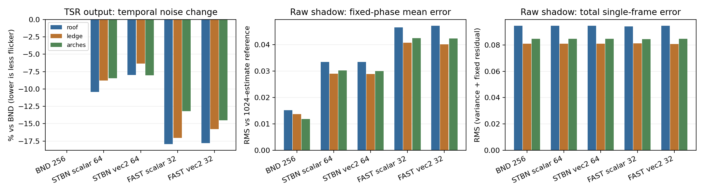
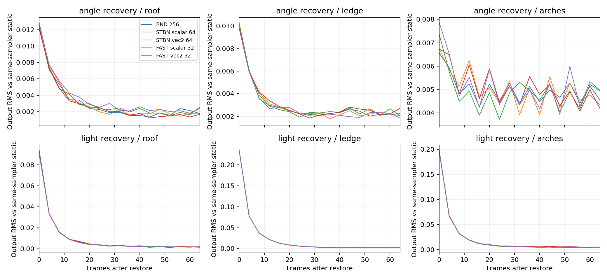

已完成公开蓝噪声图集对照，暂保留 BND 默认实现。原生二维向量图集没有解决固定颗粒问题，也没有带来一致的动态历史响应收益。本轮有效渲染全部使用公开预生成数据；没有使用此前生成的 FAST256 数据，收到“不要再生成”的要求后未再运行生成器。

固定 VSM 4096、SMRT 4 rays × 8 steps、光源角直径 7.1°、追踪长度 10、过渡带 0.2。NativeAA 为 1920×1080，TSR 历史数 16、锐化 0.483，局部裁剪与最终混合保持 `caa227a5` 的实现。曝光固定 EV100 12.252064。为排除页面预算影响，各组统一使用 512 个物理页面；这些质量数据不能直接用来推断常规 256 页面预算下的性能。

| 采样器 | 公开资源 | 原生时间切片 | GPU 数据量 |
|---|---|---:|---:|
| BND 1SPP temporal | 项目现有资源 | 256 | 复用 |
| STBN scalar | NVIDIA `stbn_scalar_2Dx1Dx1D_128x128x64x1` | 64 | R8，1 MiB |
| STBN vec2 | NVIDIA `stbn_vec2_2Dx1D_128x128x64` | 64 | RG8，2 MiB |
| FAST scalar | EA `real_uniform_gauss1_0_exp0101_separate05` | 32 | R8，0.5 MiB |
| FAST vec2 | EA `vector2_uniform_gauss1_0_exp0101_separate05` | 32 | RG8，1 MiB |

NVIDIA 官方仓库明确提供预生成图集；本轮选用均匀 vec2，没有把 unit-vector/cosine 数据当成均匀相位。[NVIDIA STBN](https://github.com/NVIDIA-RTX/STBN/tree/48b2839e4d8b7f0202ac72c6b0ae720d235a5b8b)。EA 只读取公开的 `noise.zip`，使用 Gaussian spatial / exponential α=0.1、β=0.1 / Separate weight=0.5 的数据。[EA FAST](https://github.com/electronicarts/fastnoise/tree/2cf53e4bb510d07511fe63a312556d2a2e108c70)。下载归档、逐切片及提取通道的哈希在 [texture-provenance.json](texture-provenance.json)。原生切片均无重复；没有重新排序、重采样或拼接成 256 切片。

纹理使用 128×128 的线性 Texture2DArray，关闭 mipmap 与过滤，通过整数 `Load` 读取。标量版本用四个固定 R2 偏移 `(0,0)、(96,72)、(65,17)、(33,90)` 取得四个相位；vec2 版本保留 RG 配对，用前两个偏移分别提供光源圆盘与接收面采样的二维相位。时间索引始终为 `frame % depth`。两种方式均保留原来的径向分层、旋转角序列和接收面 Hammersley 采样，因此这是“标量相位 vs 配对二维相位”的对照，尚未改成每条射线直接读取独立 disk/vector 样本。主 resolve、场景调试预览和重放诊断绑定同一噪声资源，预览已正常输出。

五个采样器分别采集静态、角直径变化及静止接收面光照强度阶跃，共 15 组、4,320 帧。每组预热至少 256 帧，记录 288 帧；静态分析使用末尾 256 帧，按同一 TSR 抖动相位扣除均值后计算时间 RMS。统计区域为屋檐、横梁、拱门。

| 采样器 | 输出时间 RMS 变化：屋檐／横梁／拱门 | 原始阴影固定相位均值误差 RMS：屋檐／横梁／拱门 |
|---|---|---|
| BND | 基线 | 0.0152 / 0.0136 / 0.0119 |
| STBN scalar | −10.44% / −8.77% / −8.45% | 0.0335 / 0.0290 / 0.0302 |
| STBN vec2 | −7.98% / −6.34% / −8.02% | 0.0334 / 0.0289 / 0.0299 |
| FAST scalar | −17.94% / −17.05% / −13.22% | 0.0465 / 0.0407 / 0.0424 |
| FAST vec2 | −17.83% / −15.79% / −14.51% | 0.0471 / 0.0401 / 0.0422 |

固定误差复用上一轮每个抖动相位 1,024 次独立 phase 积分的数值参考。本轮 BND 的首尾原始阴影与参考采集逐像素一致，且几何与采样参数全部对齐。参考自身 RMS 不确定度约为 0.0030 / 0.0025 / 0.0027。它验证的是同一个 SMRT 估计器的采样残差，并不是几何光追真值。跨会话彩色输入存在差异，因此没有把这个参考用作最终彩色图像的真值。[参考核验](reference-reuse-check.json)、[参考误差](reference-comparison.json)。

原始阴影的单帧总误差基本不变：屋檐约 0.094、横梁约 0.081、拱门约 0.085。二维向量替换没有显著降低固定残差；短周期留下的平均误差仍然明显。当前 TSR 有 8 个抖动相位，同一相位在一个完整噪声周期内分别看到 BND 32、STBN 8、FAST 4 个不同切片。这与固定残差大小一致，但本轮仍未独立证明周期是唯一原因。

动态对照在前 64 帧改变角直径或把光照降为 0.35 倍，随后恢复。STBN vec2 的亮度恢复前 32 帧输出 RMS 相对 BND 为 −3.25% / −0.04% / +0.67%，角度恢复为 −0.85% / +1.94% / −3.23%。FAST vec2 的角度恢复为 +7.02% / +0.45% / +7.07%。差异没有呈现一致优势，不支持把二维向量图集当作历史响应修复。曲线尾部仍含其他随机着色残差；本轮未测相机或遮挡物移动。

下一步建议固定公开图集，单独验证逐射线直接采样及其与 TSR 抖动的配合，继续同时记录时间噪声和固定残差。当前数据支持继续保留 BND；仅切换到公开 STBN/FAST 图集不足以解决这个瑕疵。

验证：15 组均为 Active、设置匹配、无页面溢出、诊断网格无缺页；重放最大差异 0.00048822。4,320 帧的相机、采样序号、抖动、GPU VP、曝光及光照强度均对齐；角度记录最大差异仅 4.77e−7°。46 个 DXC 编译组合及 Runtime / Editor / Editor.Tests 的 Roslyn 编译通过。Editor 运行期间没有调用 Unity Test Framework；完整相关测试可在 Editor 空闲时手动运行。GPU 读回具有明显开销，本轮没有测量或宣称 GPU 耗时改善。

对照代码保存在 [diagnostic.patch](diagnostic.patch)、[PublicBlueNoiseProbe.cs.txt](PublicBlueNoiseProbe.cs.txt) 和 [VSMBNDCompareAudit.compute.txt](VSMBNDCompareAudit.compute.txt)。公开数据仍保留在 `provenance.json` 指定的本机 Temp 目录；没有把噪声图集纳入 Runtime，也没有修改 PipelineResources.asset。原生截图和逐帧参数压缩记录位于 `records`，完整 HDR 帧保留在本机采集目录。

实验收尾已完成：五个生产源文件与实验前备份逐字节一致，临时诊断类型已卸载，临时场景对象为零。已退出 Play，并恢复原有相机、光照、TSR 和时间设置；场景原有的 VSM 2048 与常规页面预算也已恢复，4096 / 512 页仅用于本轮对照。恢复后 Runtime / Editor / Editor.Tests 再次编译通过，最后一次程序集重载之后未发现 C#、shader 或 keyword 错误。[源文件恢复核验](source-restoration.json)、[Unity 最终状态](final-state.json)、[恢复后编译](csharp-restored-validation.json)、[日志核验](final-log-audit.json)。

复现时在基线提交上检查并应用补丁，将两个诊断源复制到 `Editor/Tools` 并去掉 `.txt`，让 Unity 自动生成 `.meta`。从包根目录运行 `fetch-resources.ps1`，它只下载、校验并提取公开图集，不调用生成器。正常进入 Play 后执行 `Tools/VividRP/Diagnostics/Capture Temporary Public Blue Noise`。采集器会自动完成各组、恢复临时设置并退出 Play。NVIDIA 与 EA 的原始许可文本随报告保留；本轮是本机评估，没有将图集作为生产资源分发。
