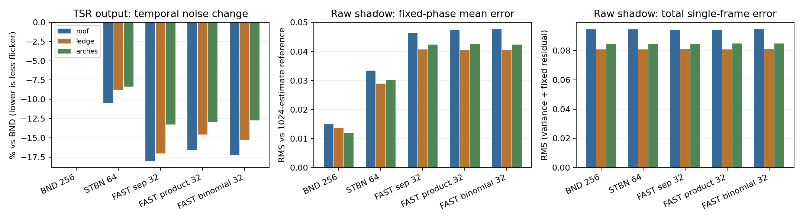

已完成真实 STBN／FAST 纹理对照。本轮保留 BND 默认值：候选序列降低了最终输出的时间噪声，但高样本参考显示，它们也留下了更大的固定残差，尚不能据此认定总画质提升。

基线提交为 `caa227a5`。实验在 VividRP_Reborn 的 Sponza 场景中进行，固定 VSM 4096、SMRT 4 rays × 8 steps、光源角直径 7.1°、最大追踪长度 10、过渡带 0.2、PCF 开启、旧随机 PCF 关闭。为排除页面预算影响，质量实验统一使用 512 个物理页面。NativeAA 输出为 1920×1080，TSR 历史数 16、锐化 0.483、曝光固定 EV100 12.252064。上一轮的局部历史裁剪及最终混合代码保持不变。

| 实际纹理来源 | 时间切片 | GPU 资源 | 接入方式 |
|---|---:|---:|---|
| 现有 BND 1SPP temporal | 256 | 复用项目资源 | 原有四维 phase |
| NVIDIA scalar STBN | 64 | 128×128×64 R8，1 MiB | 四个固定 R2 空间偏移 |
| EA FAST Gaussian Separate | 32 | 128×128×32 R8，0.5 MiB | 同上 |
| EA FAST Gaussian Product | 32 | 同上 | 同上 |
| EA FAST Binomial 3×3 Product | 32 | 同上 | 同上 |

使用官方预生成数据，下载归档、逐切片与转换后 R8 的 SHA-256 均记录在 [texture-provenance.json](texture-provenance.json)。NVIDIA 提供的预生成资源位于 [STBN SDK](https://github.com/NVIDIA-RTX/STBN/tree/48b2839e4d8b7f0202ac72c6b0ae720d235a5b8b/Assets)，FAST 来自 [EA 官方仓库](https://github.com/electronicarts/fastnoise/tree/2cf53e4bb510d07511fe63a312556d2a2e108c70)。没有用 BND 加时间偏移冒充 STBN。

纹理以线性 R8 Texture2DArray 上传，无压缩、mipmap 或双线性过滤。索引为 `((pixel + offset) & 127, frame % depth)`，四维偏移为 `(0,0), (96,72), (65,17), (33,90)`。各相位保持连续时间切片，没有逐帧散列时间或平移纹理。按作者建议，用固定 R2 偏移获取额外采样维度。[NVIDIA 使用说明](https://developer.nvidia.com/blog/rendering-in-real-time-with-spatiotemporal-blue-noise-textures-part-2/)

这是一轮“噪声来源替换”对照：保留原有等面积径向分层与接收面 Hammersley 偏移。未同时改为逐射线直接读取 cosine-vector／disk-vector。FAST 选择的预计算参数为 exponential α=0.1、β=0.1；它们没有针对项目中非线性的 TSR 重投影、裁剪和最终混合重新优化。EA 明确区分联合时空滤波适用的 Product 与偏重时间累积的 Separate，不能仅凭 FAST 名称推断最佳配置。[FAST 设计与使用说明](https://github.com/electronicarts/fastnoise/blob/2cf53e4bb510d07511fe63a312556d2a2e108c70/FastNoiseDesign.md)

五个采样器分别采集静态、光源角直径变化、静止接收面光照强度阶跃，共 15 组。每组预热至少 256 帧、记录 288 帧；静态统计使用最后 256 帧。静态逐帧保存原始阴影、TSR 输入及输出；动态每四帧保存一次主要信号。固定边缘掩码复用上一轮，区域是屋檐、横梁、拱门。以下时间噪声先减去同一 TSR 抖动相位的平均值，避免把固定的抖动差异算作随机噪声。

| 采样器 | 屋檐输出时间 RMS 变化 | 横梁 | 拱门 | 原始阴影固定相位平均误差 RMS：屋檐／横梁／拱门 |
|---|---:|---:|---:|---|
| BND | 基线 | 基线 | 基线 | 0.0152 / 0.0136 / 0.0119 |
| STBN | −10.45% | −8.78% | −8.34% | 0.0335 / 0.0290 / 0.0302 |
| FAST Gaussian Separate | −17.96% | −17.04% | −13.24% | 0.0465 / 0.0407 / 0.0424 |
| FAST Gaussian Product | −16.53% | −14.56% | −12.92% | 0.0475 / 0.0404 / 0.0425 |
| FAST Binomial Product | −17.27% | −15.29% | −12.71% | 0.0477 / 0.0406 / 0.0423 |

右列使用额外的 GPU 数值积分参考：沿用相同 SMRT 算法、页表选择、接收面偏置、4×8 估计器和滤波支撑，每个 TSR 抖动相位累计 1,024 次独立四维均匀 phase 估计。两个独立的 512 次子集给出的参考自身 RMS 不确定度约为 0.0030 / 0.0025 / 0.0027。参考图不是几何光追真值，因此不能验证 SMRT 深度近似的系统误差；它能隔离本轮采样积分残差。[完整参考误差](reference-comparison.json)

原始阴影的单帧总误差几乎相同：屋檐约 0.094、横梁约 0.081、拱门约 0.085。结合更大的固定平均误差，说明不能仅按较低的时间 RMS 选择默认采样器。当前 TSR 有 8 个抖动相位；同一相位在一个周期内只有 BND 32、STBN 8、FAST 4 个不同时间切片。这一周期关系与观察到的残差一致，但本轮没有用等周期纹理进一步隔离因果。最终彩色输出没有无噪声参考，不能把原始阴影参考误差直接当成 TSR 输出误差。

光照强度在前 64 帧保持 0.35 倍，随后恢复；角直径在前 64 帧由 7.1°变化至 3.55°附近后恢复。FAST Separate 的亮度恢复前 32 帧输出 RMS 相对 BND 变化为 −1.11% / +0.03% / −0.17%，没有一致的响应收益。角度恢复同样没有稳定优势。本轮不包含相机或遮挡物移动。[动态响应曲线](dynamic-response.png)

原生截图右上角是场景自带的 VSM 调试预览；候选纹理截图中它呈洋红色。该 DebugPass 复用主 compute，但未绑定本轮临时噪声数组，其输出清屏色为洋红，因此不作为质量证据。统计区域完全在预览之外，数据来自主阴影/TSR资源与另行绑定完整参数的诊断 shader。

采样序号、相机位置/旋转、GPU VP、TSR 抖动、页面容量均对齐。角度对照仅第 0 帧存在 4.77e−7°的浮点记录差异，其余帧一致；静态分析排除了起始 32 帧。15 组均为 Active、无页面溢出、诊断网格无缺页。重放检查的常规最大差异为 0.0004883；STBN 静态首帧为 0.002608，该帧不参与统计。参考实验与主实验的 BND 原始阴影在首尾帧逐像素一致；彩色输入存在跨 Play 会话差异，因此参考仅用于原始阴影误差判断。

下一步优先生成真正的 128×128×256 FAST Separate 序列，继续保持 4096、4×8 与 TSR 不变，复测时间噪声和固定残差。先把周期这个变量独立验证，再对照直接 vector/disk 采样是否更好地保留谱特性。Product 是否适用，需要与实际空间滤波一起验证。增加纹理空间尺寸、增大软阴影半径或继续放宽 TSR 裁剪，都没有被本轮数据证明可以解决这个问题。

实验性 C#/shader 入口已撤回，生产 BND 和 TSR 保持基线提交的实现。场景恢复实验前的 2048 配置，摄像机、光源、时间设置及运行状态已恢复；所有有效对照都在 4096 下完成。没有改变 PipelineResources.asset，没有保留临时 Editor 资源。本轮 GPU 读回会影响性能，没有据此宣称 GPU 耗时改善。

验证包括 46 个主 shader/诊断 shader 编译组合、独立参考 kernel 的 DXC 编译，以及 Runtime、Editor、Editor.Tests 的 Roslyn 编译。撤除临时 shader keyword 与 C# 钩子之间的重载窗口出现过 keyword 不存在的诊断，控制台仍保留该条记录。Editor.log 确认最后一次程序集重载后没有再出现该 keyword 错误。恢复后已核验临时采集类型卸载、生产源码与基线一致，且三个程序集重新编译通过。Editor 正在使用，因此未运行 Unity Test Framework；如需完整回归，请手动运行相关 VSM／TSR 测试。验证 JSON 和恢复状态随本目录保存。

复现材料包括 `diagnostic.patch`、四个 `.cs.txt`/`.compute.txt` 诊断源文件、分析脚本、逐帧参数日志、原始参考累积数据和官方资源哈希。完整原始 HDR 帧留在 `provenance.json` 指定的本机 Temp 目录；仓库仅归档静态最终 PNG 和紧凑统计。脚本从包根目录运行。要重建实验入口，应在干净的基线提交上检查并应用补丁，将诊断源复制回 `Editor/Tools` 并去掉 `.txt`，运行 `fetch-resources.ps1` 获取和转换纹理，再由 Unity 刷新生成元数据。采集菜单为 `Tools/VividRP/Diagnostics/Capture Temporary STBN FAST` 与 `Capture Temporary STBN Reference`，需要 Play Mode。采集器会自动完成各组并退出 Play Mode。

没有将下载的噪声纹理纳入 Runtime 或随报告重新分发。NVIDIA 下载包的许可包含研究/评估用途限制，EA 包采用 BSD 3-Clause；原始许可文本已一并记录。[NVIDIA 许可](https://github.com/NVIDIA-RTX/STBN/blob/48b2839e4d8b7f0202ac72c6b0ae720d235a5b8b/License.txt)、[EA 许可](https://github.com/electronicarts/fastnoise/blob/2cf53e4bb510d07511fe63a312556d2a2e108c70/LICENSE.txt)
