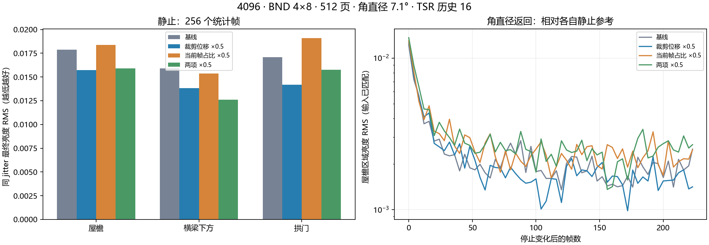

固定 4096 / SMRT 4×8 / BND：历史裁剪与最终混合对照（2026-09-09）

本轮结果支持优先研究“有条件地减轻历史裁剪”。单独将裁剪位移减半，三个目标区域的最终时域噪声下降 12%–17%，实际历史权重基本不变。单独将当前帧占比减半并未带来一致收益。组合组改善横梁区域更多，但动态残留和亮度均值变化也更大。本轮不将诊断参数作为正式优化启用。

实验基于 `713213bd`（Bind blue noise resources for SMRT shadow sampling）。生产代码的临时改动保存在 `experiment.patch`，采集器以 `.txt` 归档；实验后恢复原始源码和原场景设置。

**变量定义与控制**

裁剪组：在原有拒绝/光照变化确认公式执行后，将裁剪结果向裁剪前历史回插 0.5，即 `H_test = lerp(H_clipped, H_reprojected, 0.5)`；含义是裁剪位移减半，并非邻域包围盒宽度或方差阈值减半。

混合组：在正常历史权重限制后，将已接受历史的权重改为 `w_test = lerp(w, 1, 0.5)`，即当前帧贡献减半。静止光照变化被确认后，仍应用原来的 0.75 历史权重上限。这项诊断会放宽其他正常权重限制，不应直接作为通用参数落地。

拒绝/确认算法保持原样；历史轨迹改变后，后续帧的判定可以自然变化，因此不是冻结同一份 rejection mask 的离线重放。额外读回私有历史 alpha 中的实际混合权重，最终输出 alpha 保持 1。

所有组固定 VSM 4096、SMRT 4 rays × 8 steps、BND 1SPP 变体时序、角直径 7.1°、有效最大射线长度 10、PCF 开启、旧随机 PCF 关闭。屏幕密度选层开启，first level 0、target 1 pixel、LOD bias 0、transition 0.2。物理池临时统一为 512 页以隔离页面不足；这是诊断环境，不能推导原 256 页或 7.3 ms 预算下的收益。

NativeAA 1920×1080、TSR history 16、sharpen 0.483、固定曝光 EV100 12.252064。相机与光源的初始位置/朝向来自 `initial-state.json`。所有配对固定 jitter 与独立 SMRT 逻辑采样帧；真实页面帧号继续递增，避免破坏页面有效性检查。

**静止结果：同一缓存、同一输入**

主结论使用补测 `20260909_135011_413`。预热/priming 后，四组之间保留 VSM 缓存，只重置 TSR 历史；每组预热至少 256 帧，再记录 288 帧。分析后 256 帧，按 8 个 jitter 相位分别去均值，覆盖完整 256 帧 BND 序列。使用事先保存的共同阴影边缘 mask；ROI 为 (715,190,400,495)。统计是线性 TSR 输出亮度的时域 RMS，不是几何误差或高采样真值误差。

全部三组相对基线，在所有记录帧的整个 ROI 内，原始阴影及 TSR 输入 RGBA 的最大绝对差均为 **0**；相机、投影、jitter、采样帧、角直径也一致。无页面 overflow，诊断缺页像素为 0。重放诊断并非源数据一致性的依据；其最大误差约 0.002608，源输入的逐像素比较独立执行。

最终噪声相对基线的变化，负值表示下降：

| 对照 | 屋檐 | 横梁下方 | 拱门 |
|---|---:|---:|---:|
| 基线 | +0.0% | +0.0% | +0.0% |
| 仅裁剪位移 ×0.5 | -12.1% | -13.1% | -16.9% |
| 仅当前帧占比 ×0.5 | +2.7% | -3.4% | +11.8% |
| 两项同时 ×0.5 | -11.2% | -20.8% | -7.7% |

基线三个区域 RMS 分别为 0.017891、0.015902、0.017084。空间高斯 σ=1 后再计算时域 RMS，裁剪组仍改善三个区域；混合组的三个区域均变差，因此混合组横梁的原始 RMS 小幅下降不能代表一致的视觉降噪收益。

实际历史平均权重（接受历史的像素）：

| 对照 | 屋檐 | 横梁下方 | 拱门 |
|---|---:|---:|---:|
| 基线 | 0.9388 | 0.8754 | 0.9335 |
| 仅裁剪位移 ×0.5 | 0.9383 | 0.8749 | 0.9332 |
| 仅当前帧占比 ×0.5 | 0.9668 | 0.9362 | 0.9622 |
| 两项同时 ×0.5 | 0.9662 | 0.9357 | 0.9617 |

裁剪组的历史权重几乎不变，裁剪位移 RMS 从约 0.00970/0.02196/0.01831 降到 0.00604/0.01201/0.01069。这支持“裁剪对随机当前邻域的跟随是残余噪声的重要来源”，但并不证明它是唯一来源。裁剪发生比例没有下降，不能把收益解释为更少的裁剪事件。

平均亮度相对基线的变化：

| 对照 | 屋檐 | 横梁下方 | 拱门 |
|---|---:|---:|---:|
| 基线 | +0.0% | +0.0% | +0.0% |
| 仅裁剪位移 ×0.5 | -1.4% | -1.1% | -1.2% |
| 仅当前帧占比 ×0.5 | -1.7% | -3.4% | -2.4% |
| 两项同时 ×0.5 | -3.7% | -4.9% | -4.3% |

本轮没有高采样真值，均值变化不能认定为偏差修正；更少的波动也不等于更准确。组合组应特别检查暗部偏移及对比度变化。

**静止接收面的光照变化响应**

主采集 `20260909_134044_569` 中，光源方向固定，角直径在前 64 帧按 7.1°→3.55°→7.1° 变化，随后保持 224 帧。每组动态结果与该组、同一运行、同一逻辑帧/jitter 的静止结果比较。动态四组之间的原始阴影/TSR 输入逐像素一致。下表只采用屋檐区域：此处动态停止后与各自静止参考的源输入也完全一致。

| 对照 | 停止后 0–16 帧的平均残差 RMS | 停止后 160–223 帧的平均残差 RMS |
|---|---:|---:|
| 基线 | 0.006520 | 0.001813 |
| 仅裁剪位移 ×0.5 | 0.006838 | 0.001579 |
| 仅当前帧占比 ×0.5 | 0.007009 | 0.002274 |
| 两项同时 ×0.5 | 0.007642 | 0.002447 |

裁剪组早期残差约增加 4.9%，尾段低于基线；混合组早期增加约 7.5%、尾段约 25%；组合组早期增加约 17.2%、尾段约 35%。这些是历史路径造成的输出差，不是测得的延迟百分比或稳定所需帧数。该输入仅覆盖角直径变化，没有代替突发光照、运动遮挡物和真实显隐测试。

**无效或受限的数据**

- `20260909_133526_571` 仅作采集器预演，因全历史读回开销主动中止，未完成配对，排除。
- 主采集第一组静止基线在右侧细杆附近有局部原始输入差异，因此主采集静止结果不用于最终因果表格；已通过保留同一缓存的四组补测消除。
- 主采集相机移动组存在源阴影/源颜色差异，本轮不能确认其差异由 TSR 单独造成，不用于宣称移动稳定性改善。
- 跨 Play 运行的静止/动态参考有小幅源颜色差异，不用于光照响应表格。
- GPU 读回严重干扰时间开销；本轮不提供 GPU 性能结论。PNG 只用于画面检查，统计来自浮点读回。

**下一步**

先保持最终混合公式不变，研究几何历史可靠、无已确认光照变化、具有随机阴影噪声证据时的局部裁剪放宽。真实光照改变、显隐及薄几何仍需保留当前保护。先对照“局部放宽”与本轮全局半裁剪，验证静止降噪、光照阶跃、移动遮挡物、相机移动和平均亮度，再决定是否落地；单纯提高历史占比优先级下降。本轮尚未证明独立 SMRT 时空降噪器或专门 STBN 的收益。

**文件与复现**

`static-summary.json` 是有效静止补测；`dynamic-and-initial-summary.json` 保留主运行及输入一致性检查；`decision-summary.json` 给出本文派生比例。`static-fixed-cache/` 与 `dynamic-and-initial/` 保存参数清单、帧记录、源码哈希，以及有效静止组与角直径变化组的末帧截图。原始浮点数据保留在仓库下 `Temp~/tsr-clamp-static-captures/20260909_135011_413` 与 `Temp~/tsr-clamp-captures/20260909_134044_569`，未复制进 Roadmap。

从包根目录运行 `python Roadmap~/Experiments/TSRClampMix4096_20260909/analyze.py <capture-root> <empty-analysis-directory>` 可重新分析原始数据；需 numpy/scipy，绘图还需 matplotlib。不同运行必须使用不同输出目录，避免读取旧的按阶段缓存。`plot.py` 读取归档汇总后生成 `comparison.png`。采集器及诊断 patch 仅供复现实验，在隔离工作副本中应用；不是可直接发布的改动。

DXC 检查 16 个 TSR 变体、38 个 VSM kernel 全部通过。Roslyn 检查 Runtime/Editor/Editor.Tests 三个程序集通过；后加的同缓存采集器由当前 Unity Editor 编译并运行完成。未运行 Unity Test Framework：Editor 处于交互会话，遵守仓库限制；如需执行，可手动运行 TSRLightingResponseTests 与 TSRUpscalerPassTests。恢复结果见 `final-state.json`、`restoration.json` 和 `final-console.json`。
