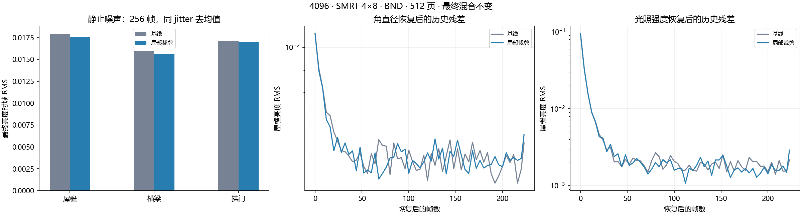

4096 / SMRT 4×8 / BND：局部历史裁剪放宽（2026-09-09）

本轮落地局部裁剪放宽，最终混合公式保持不变。经过多种门控对照，保留较简单的几何、亮度波动与颜色一致性门控；收益有限，没有达到此前全局半裁剪约 12%–17% 的静止降噪幅度。未保留新增时序状态或完整邻域范围限制。

**实现**

仅修改 `TSRRejectShading.compute` 的裁剪结果，新增的 GPU 回归用例放在 `TSRLightingResponseTests.cs`。先执行原有拒绝和光照变化确认，再将可靠像素的裁剪结果向未裁剪历史回插，最多恢复一半裁剪位移。

资格要求：连续接收面、历史至少 4 个样本、运动小于 0.5 pixel、重投影边界小于 0.25、当前/历史深度匹配、当前与上一帧均无光照变化确认状态。放宽量随现有亮度波动指标、邻域颜色范围、历史与邻域中心的亮度/色度一致性平滑变化。均匀邻域或明显颜色不相容时保留完整裁剪；重建范围内发现几何轮廓时也保留完整裁剪。

`_LumaInstability` 是通用波动信号，不等于 SMRT 噪声分类器。实现没有新增纹理、渲染 pass、历史状态编码或运行时 C# 配置。`TSRUpdateHistory.compute` 与 `TSRResolveHistory.compute` 在移除诊断后恢复到实验前的完整字节内容。三帧光照确认、0.75 历史权重上限和复活历史逻辑保持原样；历史内容变化仍可自然影响后续帧的判定。

**最终有效对照**

最终运行 `20260909_144953_664`，两个版本各覆盖静止、角直径变化、强度阶跃。固定 VSM 4096、4 rays × 8 steps、BND 1SPP 时序、512 页、NativeAA 1920×1080、history 16、sharpen 0.483、固定曝光 EV100 12.252064。每组预热至少 256 帧，记录 288 帧。静止统计后 256 帧，按 8 个 jitter 相位分别去均值，并使用预先保存的共同边缘 mask。

静止结果相对基线：

| 指标 | 屋檐 | 横梁 | 拱门 |
|---|---:|---:|---:|
| 最终亮度时域 RMS | -1.84% | -2.06% | -0.92% |
| 平均亮度 | -0.40% | -0.23% | -0.24% |

三个场景的配对组中，所有捕获帧的整个 ROI 内，原始阴影及 TSR 输入 RGBA 的最大绝对差均为 0，见 `*-input-audit.json`。这里度量时域稳定性，没有高采样或几何真值，均值变化不能认定为准确度改善。该局部门控不能解决目前大部分可见边缘噪点。

角直径在前 64 帧按 7.1°→3.55°→7.1° 变化。强度阶跃在前 64 帧降至 35%，第 64 帧恢复；强度提前在上一帧结束时设置，避免灯光准备早于修改产生首帧不一致。动态结果与各自同一运行、同一 jitter/采样帧的静止参考比较。

恢复后 0–16 帧的平均亮度残差 RMS：

| 场景 / 版本 | 屋檐 | 横梁 | 拱门 |
|---|---:|---:|---:|
| 角直径恢复 / 基线 | 0.006430 | 0.005028 | 0.004257 |
| 角直径恢复 / 局部裁剪 | 0.006182 | 0.004934 | 0.004155 |
| 强度阶跃恢复 / 基线 | 0.031937 | 0.076739 | 0.065506 |
| 强度阶跃恢复 / 局部裁剪 | 0.031684 | 0.076756 | 0.065477 |

这些残差不是响应延迟或拖影消除率。`decision.json` 还保存尾段残差和恢复后源输入误差。运动遮挡物、快速相机运动和升采样模式尚未单独验收。

**方案取舍**

- v1，颜色中心一致性门控：首轮噪声下降约 1%–2%。选用其实现，并在最终运行重新核对静止和动态响应。
- v2，受当前邻域完整范围限制的恢复目标：噪声增加约 2%–9%，舍弃。
- v3，单帧空间残差方向门控：没有有效降噪，舍弃。
- v4，跨帧方向翻转置信度：噪声仅下降约 0.4%–1.6%，强度恢复后屋檐早期残差增加约 6%；复杂状态未带来更好的取舍，舍弃。
- v1 首轮强度阶跃的局部组第 0 帧源输入不一致，不能用于严格比较；最终运行使用提前调度后的数据。

后续若需要显著降噪，应先取得阴影专用的时序置信度或独立阴影信号，避免仅根据最终着色颜色放宽几何与光照保护。本轮不把全局半裁剪或更高历史混合权重作为默认替代。

**验证和文件**

最终源码通过 16/16 个 Shader 变体的 DXC 编译，以及 Runtime、Editor、Editor.Tests 三个程序集的 Roslyn 编译；检查期间源码和 Bee 响应文件保持稳定。Unity 导入的四个相关 TSR Shader 无编译消息，恢复后控制台无新增错误。新增 11 个 GPU 测试案例覆盖裁剪幅度、均匀光照阶跃、运动、历史深度不符、历史未成熟、待确认状态及附近几何轮廓。Unity Editor 处于交互会话，未执行 Unity Test Framework；请手动运行 `TSRLightingResponseTests` 和 `TSRUpscalerPassTests`。

所有临时运行代码与采集资产均已移除。场景设置与开始时逐项一致，包括原有 2048 场景分辨率；4096 仅用于本轮对照。最终保留两个源码文件的改动，其余生产文件恢复到原始内容。

512 页用于隔离缺页干扰；读回干扰性能，本轮未测 GPU cost，不能宣称仍满足 7.3 ms 预算。Shader 多了一次局部资格判定，并在需要放宽时检查重建范围；没有新增生产 C# 热路径，因此不引入对应的托管分配。

`records/` 保存压缩帧记录和代表截图。原始浮点读回位于包根目录下 `Temp~/tsr-local-clamp-final-captures/20260909_144953_664`。`summary.json`、`decision.json` 和输入审计为最终统计，v1–v4 汇总保留方案取舍依据。分析脚本按包根目录运行，依赖 numpy/scipy/matplotlib；原始数据仍在本机 Temp~ 中。`.txt` 采集器与 `diagnostic.patch` 仅供复现，已从生产代码移除。恢复检查见 `restoration.json`、`final-state.json`、`final-console.json`。
