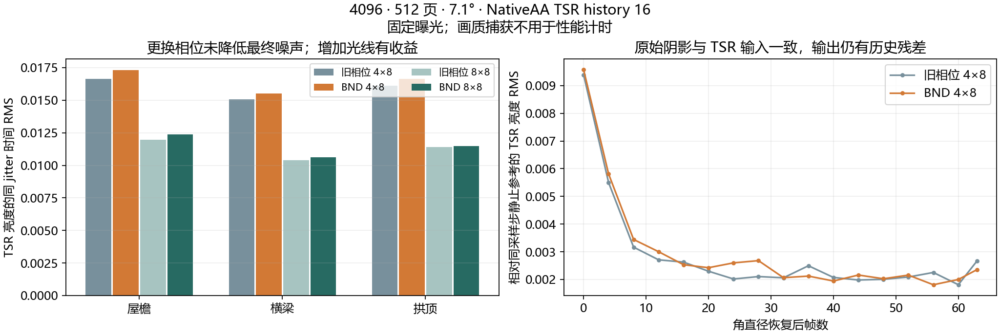

**4096 VSM / SMRT：BND 1SPPTemporal 对照与 TSR 历史诊断（2026-09-09）**

本轮完成已有 BND 接入的画质、动态历史响应及 GPU 耗时对照。当前接法没有降低最终 TSR 输出的时域噪声：4 rays × 8 steps 下，三个目标区域的同 jitter 亮度 RMS 比旧采样高约 3%–4%。BND 原始阴影的部分低频残差略有改善，但没有传递到最终输出。下一步优先做 TSR 历史裁剪和光照变化确认的独立对照。

本轮未新增生产渲染算法改动。保留提交 `713213bd` 中的 BND 接入；临时采样切换、采样帧覆盖、512 页预算和 GPU marker 均已撤除。这里的 BND 1SPPTemporal 不等同于专门设计的 STBN。

**实验条件与统计口径**

项目为 `E:/VividRP_Reborn`，主相机 Camera_1，输出 1920×1080。所有对照固定 VSM 4096、方向光角直径 7.1°、8 steps、SMRT 开启、PCF 开启、旧 9 次随机 PCF 关闭、首层 0、屏幕密度目标 1、LOD bias 0、覆盖过渡 0.2。TSR 使用 NativeAA、历史 16、锐化 0.483；曝光固定 EV100 12.252064。偏移设置在各组间保持一致。

画质主实验临时使用 512 个物理页，消除页池溢出干扰；另做 256 页的静止对照。性能使用生产配置的 256 页。512 页画质结果不能当作 256 页全画面质量验收。

画质共 10 组、1,216 个记录帧，均为 Active。每组先预热至少 256 帧；静止组记录 128 帧，统计第 32–127 帧，并按 8 个 TSR jitter 相位分别去均值。A/B 的相机、投影、jitter、光源参数及逻辑 SMRT 采样帧均对齐。独立采样帧只影响 SMRT，页面有效性仍使用真实相机帧号。

统计使用屋檐、横梁下方、拱门三个共同边缘/半影掩码。掩码由两组 4-ray 静止阴影均值生成，三个区域的像素范围记录于 `summary.json`。亮度 RMS 衡量时域稳定性，不代表相对真实光线追踪的几何误差。低频统计中的 Gaussian σ=1/2 仅用于离线分析，未加入渲染流程。本轮没有覆盖完整 256 帧序列周期的画质统计。

**静止结果：最终 TSR 同 jitter 亮度 RMS，越低越好**

| 512 页配置 | 屋檐 | 横梁下方 | 拱门 |
| --- | ---: | ---: | ---: |
| 旧采样 4×8 | 0.016629 | 0.015061 | 0.016122 |
| BND 4×8 | 0.017299 | 0.015517 | 0.016622 |
| 旧采样 8×8 | 0.011946 | 0.010383 | 0.011389 |
| BND 8×8 | 0.012357 | 0.010625 | 0.011474 |

BND 相对旧采样：4×8 的 RMS 增加 3.0%–4.0%，8×8 增加 0.7%–3.4%。在 BND 内将 4 rays 增至 8 rays，三个区域 RMS 分别下降 28.6%、31.5%、31.0%；这是本轮最明确的降噪收益，但需要额外采样成本。

4×8 原始阴影低频 RMS 的 BND/旧采样比值：σ=1 为 0.983、0.944、0.981；σ=2 为 0.959、0.918、0.971。最终 TSR 对应比值分别为 1.028、1.020、1.048 和 1.009、1.003、1.052。说明原始分布有局部收益，当前整个历史处理链没有保留这一收益；不能据此断言历史裁剪是唯一原因。

256 页下 BND/旧采样的最终 RMS 比值为 1.041、1.031、1.032，结论相同。不过两组溢出请求中位数均为 191.5，存在缺页采样；中央 ROI 相近不能证明其他区域没有问题。512 页各组溢出为零。

**动态 TSR：区分当前输入变化与历史残留**

相机沿 `(1.5, 0, 1.5) × sin(π × step/63)` 往返，64 帧后停止，再记录 32 帧。光源测试固定方向，只将角直径从 7.1° 降至 3.55° 再回到 7.1°，64 帧后保持，再记录 64 帧。停下后的每个采样帧与同采样帧、同 jitter 的静止参考比较。

旧采样的相机测试在停止后，原始阴影和 TSR 当前输入与静止参考完全一致，但最终 TSR 仍有残留；停止第 31 帧的三个区域 RMS 为 0.00436、0.00468、0.00856。BND 相机测试中部分区域的原始阴影仍不完全相同，可能混入页面/缓存路径差异，因此不把其输出差异全部计作 TSR 拖影。

角直径返回后，两种采样的原始阴影与当前输入均与静止参考完全一致。BND 横梁区域的最终 TSR RMS 从停止当帧的 0.00957 降至停止第 63 帧的 0.00236；旧采样为 0.00939 → 0.00267。其他区域未形成一致的 BND 响应优势。该测试证明历史状态仍影响输出，但不替代遮挡物移动或方向光旋转测试。

**补充历史诊断：接受历史之后仍会裁剪**

另捕获 BND 4×8、8×8 静止片段各 64 帧，统计 32–63 帧。直接读取现有 TSR 的重投影历史、裁剪后历史、拒绝掩码及历史计数，不修改其算法。

| BND 4×8 区域 | 历史接受率 | 已接受样本中亮度裁剪超过 0.001 的比例 | 裁剪亮度 RMS | 静止光照变化确认状态比例 |
| --- | ---: | ---: | ---: | ---: |
| 屋檐 | 100% | 14.85% | 0.00973 | 1.44% |
| 横梁下方 | 99.994% | 18.85% | 0.02194 | 0.80% |
| 拱门 | 100% | 17.63% | 0.01834 | 2.50% |

历史计数中位数约为 15.4–16。高接受率及接近上限的计数不等于历史颜色没有被持续改变。静止片段还会触发少量光照变化确认，可能包含 Monte Carlo 噪声和 jitter 覆盖差异。8 rays 下裁剪样本占比仍约 14.5%–19.3%。详细阈值与统计见 `history-analysis.py`、`history-clipping.json`。

下一步先保持 4×8、BND、4096 不变，分别对照历史颜色裁剪和最终历史混合。以几何连续性、时间上的噪声统计为条件测试适度放宽裁剪，同时保留真实光照变化的快速确认；用相同静止、移动、角直径变化流程验证。验收应同时观察最终 RMS、裁剪量、变化确认次数和停止后的残留，避免只通过增加历史权重降低噪声。若仍受采样方差限制，再比较 8 rays 或阴影信号的独立时空过滤；现有结果不足以认定换用专用 STBN 就能解决问题。

**GPU 耗时：主相机 Resolve 的观测范围**

质量读回关闭；每组预热 5 秒、测量 5 秒，正序与逆序各一轮。使用临时的主相机专属 `VSM.BNDComparison.MainCameraResolve` GPU marker，范围包含全屏 Resolve 及其中的 receiver feedback，不包含整个 VSM 页面更新与阴影渲染。各组约 701–855 个有效样本。

| 配置 | 第一轮 Resolve 中位数 ms | 第二轮 Resolve 中位数 ms |
| --- | ---: | ---: |
| 旧采样 4×8 | 2.221 | 2.373 |
| BND 4×8 | 2.303 | 2.613 |
| 旧采样 8×8 | 2.384 | 2.484 |
| BND 8×8 | 2.745 | 2.585 |

同轮 BND 增量：4 rays 为约 0.08–0.24 ms，8 rays 为约 0.10–0.36 ms。编辑器调度和时钟波动可见，这些是观测区间，不能当作稳定的硬件成本常数。

整帧 GPU 数据未可靠归属到单个相机，且生产 256 页仍有溢出，因此本轮不认证 7.3 ms 的整帧质量预算。Nsight Graphics 2026.3.1 的环境检查通过，但向核实后的主 Unity 进程 PID 6848 附加失败，返回 `Cannot find process`；未重启用户编辑器。退回上述 Unity GPU marker 测量，记录见 `nsight-attach.txt`、`timing-summary.json`。

**验证与恢复**

临时实验 Shader 的 38 个直接 kernel 通过 DXC 编译；Runtime、Editor、Editor.Tests 通过 Roslyn 编译。相关证据分别为 `dxc-validation.json`、`csharp-validation.json`。这些是编译验证，不是 Unity 单元测试运行结果。

清理后 Unity 已停止 Play、完成编译，`CSMShadowResolve.compute` 成功加载且消息数为零。相机位置、方向、FOV，光源方向及 7.1° 角直径，TSR 历史 16/锐化 0.483，场景已保存和当前有效的 VSM 2048/4×8，以及时间和后台运行设置均已恢复。临时场景对象计数为零，详见 `final-unity-state.json`。正式源码相对本轮开始的 HEAD 没有 diff，仅本实验目录为新增交付。

Unity Editor 保持打开，按仓库规则未主动运行 Unity Test Framework。需要用户手动运行的相关测试为 `VirtualShadowMapSamplingTests` 和 `VirtualShadowMapReceiverQualityTests`。

**数据与复现**

- 有效画质原始数据：`E:/VividRP_Reborn/Packages/VividRP/Temp~/vsm-bnd-compare-captures/20260909_125317_274`。
- 历史原始数据：`E:/VividRP_Reborn/Packages/VividRP/Temp~/vsm-bnd-history-captures/20260909_130034_386`。
- 性能原始数据：`E:/VividRP_Reborn/Packages/VividRP/Temp~/vsm-bnd-timing/20260909_130304_125`。
- 本目录保留首尾图、逐帧参数和状态、统计、GPU 记录及临时实验源码快照。半精度原始纹理数据仍位于上面的 `Temp~`，未重复归档；重算统计需要这些原始文件。
- `analyze.py` 从包目录运行，参数为画质原始数据路径，依赖 NumPy、SciPy 及已有 `Roadmap~/Experiments/VSMTransition4096_20260907/analyze_transition.py`；输出至 `Temp~/vsm-bnd-compare/analysis`。`history-analysis.py` 和 `plot.py` 同样以包目录为工作目录。
- `.cs.txt` / `.compute.txt` 是诊断快照，不会由 Unity 自动导入编译。临时完整源码快照用于核对具体实验差异，不应覆盖后续生产代码。
- 初次试运行 `20260909_124608_074` 因错误地覆盖页面有效性帧号而失效，已标记并排除；修正为 SMRT 独立采样帧后重新完成全部有效组。详见 `discarded-run.txt`。
