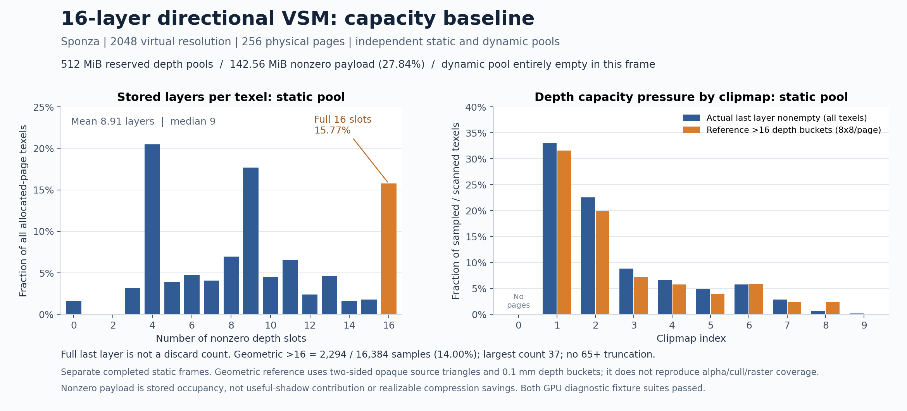

## 16 层容量与存储基线

当前静态 Sponza 机位的静态深度较密，动态深度池为空。256 个逻辑物理页各有独立的静态/动态 16 层 R32 存储，共预分配 **512 MiB**；实际非零深度 payload 为 **142.56 MiB（27.84%）**。这是按非零 slot 计算的存储占用，不代表这些 slot 都贡献了阴影，也不是已经能兑现的压缩收益。

| 全部已分配页纹素 | 静态池 | 动态池 |
|---|---:|---:|
| 预分配深度存储 | 256 MiB | 256 MiB |
| 非空纹素比例 | 98.35% | 0% |
| 平均非零层数 | 8.910 | 0 |
| 非零层数 P50 / P90 / P99 | 9 / 16 / 16 | 0 / 0 / 0 |
| 第16层非空纹素比例 | 15.77% | 0% |
| 含第16层数据的页 | 132 / 256 | 0 / 256 |
| 非零 slot / 预分配 slot | 55.69% | 0% |

512 个池/页记录、22 个池/clipmap 汇总和 2,560 个虚拟页表项通过独立 CPU 复核：直方图、层占用、空/非空守恒及页表双向所有权一致；排序、重复、中间空洞和非法深度异常均为 0。分配器同帧为 **266 请求、256 分配、10 页预算溢出**；这是页面预算指标，不能与深度层容量混为一谈。该帧所有页都由静态 caster 填充，不能据此断言动态场景永远不需要动态池。



另一次同机位完成帧使用独立 RTAS（217 个静态实例、264,754 个三角形，动态实例为 0）沿每页 8×8 个纹素中心枚举几何深度。静态池 16,384 个有效抽样中，**2,294 个（14.00%）的参考深度桶数超过 16**；最大为 37，未遇到 65 桶下界截断。level 1/2 的相应比例为 31.55%/19.97%。投影深度跨度约 1024 m，实际分桶 epsilon 为 0.0001 m。每页只抽样其 0.390625% 纹素；这些是强制 opaque、双面源三角形的几何桶统计，**不是生产插入丢弃率，更不是漏光像素比例**。

按 1 cm 最近距离容差，参考捕获中的生产深度有 **145,956 / 145,961（99.9966%）** 匹配已枚举几何；近 16 个参考表面共有 1,258 个未匹配，分布于 1,085 个抽样。匹配不是一对一，且 alpha、背面剔除、LOD、光栅覆盖及量化都会影响集合，因此不能直接把未匹配项归因为层溢出。满 16 层本身也无法证明存在第 17 层；额外表面是否造成可见性错误还需要具体接收者斜射线反例。

容量诊断的独立 GPU 夹具通过完整字段、所有权异常和 **36 个直接调用生产插入函数的光栅用例**；独立几何参考的 **18 个实际 RTAS/GPU 用例**也已通过。前者明确覆盖 16 个不同深度恰好填满但无遗漏，以及 17/32/64 个不同深度发生已知有限容量截取，未修改生产插入代码来伪造实景丢弃计数。

原始数据共 27 文件、753,736 字节已归档到 [raw/capacity](raw/capacity) 和 [raw/capacity-reference](raw/capacity-reference)，全部源/归档 SHA256 一致，见 [归档清单](capacity-archive.json)。分析现已完全从归档重跑，不依赖 Temp 目录：[实际占用](capacity-analysis.json)、[逐页分布](capacity-pages.csv)、[独立几何容量](capacity-reference-analysis.json)、[容量 GPU 结果](capacity-gpu-result.txt)、[参考 GPU 结果](reference-gpu-result.txt)。

从包根目录复现分析与图：

```powershell
python Roadmap~/Experiments/VSMCapacityCostDynamic_20260912/analyze-capacity.py Roadmap~/Experiments/VSMCapacityCostDynamic_20260912/raw/capacity
python Roadmap~/Experiments/VSMCapacityCostDynamic_20260912/analyze-capacity-reference.py Roadmap~/Experiments/VSMCapacityCostDynamic_20260912/raw/capacity-reference/frame_000 --validation-status pass --validation-evidence Roadmap~/Experiments/VSMCapacityCostDynamic_20260912/reference-gpu-result.txt
python Roadmap~/Experiments/VSMCapacityCostDynamic_20260912/plot-capacity.py
```

上述两个容量捕获是独立完成帧，未作为逐纹素严格配对差分；GPU 计时应使用另行运行的无容量扫描、无 RTAS 参考和无读回窗口。
