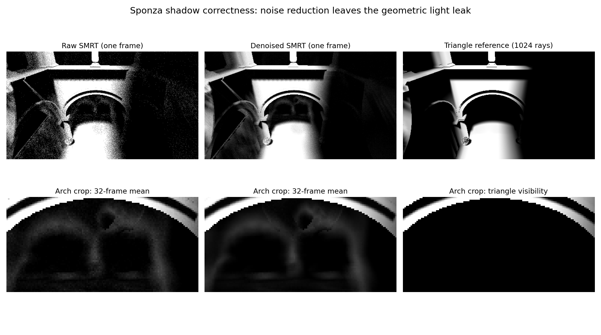

# Sponza 拱门阴影正确性检查（2026-09-12）

本轮后续已完成多层深度漏光修复，见 [八层实景验证](../VSMLayeredDepth_20260912/README.md)。以下保留前一轮的诊断记录。

前一轮只修复 **VSM + SMRT 忽略阴影去噪开关** 的问题。**拱门漏光与错误轮廓尚未修复**。已建立该视角的独立三角形参考，并测量了页预算、细层覆盖、起点抖动、光程、射线数和求交规则。没有因为某个候选能让截图更暗，就直接替换生产求交规则。

基线为 `a7c2e432`。现场 Unity 6000.7.0a6 / D3D12，Game 相机 `Camera`（未标记 MainCamera），位置 `(0.205128953, 5.076887, 4.14047146)`，旋转 `(30.1648655, 1.88177836, 0.538555264)`，1920×1080，FOV 60。太阳角径 7.1°；VSM 分辨率 2048、页预算 256、viewCoverage 关闭，SMRT 4 rays / 8 steps / 10 m，PCF 与 stochastic filtering 开启。AA 为 None，所以 JointSampling 的实际序列偏移为 0。该现场与上一轮 4096 / 1024 页 / Native TSR 的标页性能场景不同。

所有抓取都在 Edit mode 完成，没有移动相机、切换 Play、保存场景或修改原始 Volume 资产。每组预热 64 次相机记录，再抓取 32 帧；实际相机 frameIndex 用于采样。临时最高优先级 Volume 覆盖在组间切换，结束后销毁。七组初始设置与实际帧参数保存在 `baseline-settings/`。

三角形参考使用独立、无视锥剔除的临时 RTAS，包含 217 个有效投影网格、264,754 个三角形。逐接收点使用 1,024 个确定性等面积太阳盘样本，ray length 为 1,000 m；0.001 m 和 0.01 m 两种法线起点偏移同时记录，另记录主光轴硬阴影。输入取当前帧相同的深度、法线、矩阵和光源方向，采样屏幕像素为 `4 * id + 2`，共 480×270 个接收点。它不读取 VSM 深度池，也不调用 SMRT 求交。

此参考强制三角形 opaque，未评估 alpha 裁剪、顶点动画与透射；指标选择拱门实体区域，不能用全屏植物/旗帜边缘评价 alpha 正确性。固定 ROI 为诊断数组 `y=[100,163), x=[163,290)`，共 8,001 点。两种偏移的 ROI 平均可见率差为 0.0110；在偏移变化小于 0.01 的 7,715 点上，基线 MAE 仍为 0.0521，排除了起点偏移敏感像素主导漏光的解释。有限样本参考不是无限采样真值。

| 初始对照 | ROI 可见率 MAE | 过亮误差均值 | 过暗误差均值 | 分配/请求/溢出页 |
|---|---:|---:|---:|---|
| 当前配置 | 0.05366 | 0.05163 | 0.00204 | 256 / 266 / 10 |
| 仅预算 1024 | 0.05394 | 0.05194 | 0.00200 | 266 / 266 / 0 |
| 4096、1024 页、viewCoverage、coverageTransition .05 | 0.05202 | 0.04972 | 0.00231 | 743 / 743 / 0 |
| 关闭接收起点 PCF 抖动 | 0.05415 | 0.05218 | 0.00197 | 256 / 266 / 10 |
| 8 条射线 | 0.05393 | 0.05186 | 0.00207 | 256 / 266 / 10 |
| 最大光程 50 m | 0.06027 | 0.05821 | 0.00205 | 256 / 266 / 10 |
| 关闭 SMRT / stochastic，仅 PCF | 0.01576 | 0.01345 | 0.00231 | 256 / 255 / 0 |

MAE 是 `[0,1]` 阴影可见率上的平均绝对误差，不是最终 RGB 误差。正负误差均以全部 ROI 点为分母。PCF 使用中心光方向，不能以它在暗部的低误差推断其半影正确。各组 BND 相位不完全配对，32 帧均值仍有抽样误差。页预算扩容消除了这 10 个溢出页，却未解决此处主要漏光；同样，增加射线数主要降低方差。

有限厚度 SMRT 只保留最靠近光源的单层深度。实体侧壁或被前层遮住的遮挡几何不一定落在这张深度表面上。以下候选保持相同投影、采样和 DDA，仅改变命中条件；在生产代码外的 shader 副本中执行，每组 32 帧：

| 候选 | 拱门 MAE | 全屏 MAE（仅作参考） | 合成误遮挡 | 合成漏遮挡 |
|---|---:|---:|---:|---:|
| 当前 0.5 纹素厚度 | 0.05406 | 0.03621 | 915 | 3927 |
| 厚度 ×4 | 0.04763 | 0.03109 | 1137 | 3687 |
| 厚度 ×16 | 0.03719 | 0.02535 | 2082 | 3090 |
| 厚度 ×64 | 0.01791 | 0.01947 | 2979 | 1944 |
| 半空间 `surface > enter` | 0.00675 | 0.02703 | 3783 | 1290 |
| 连续两格处在前深度后方即遮挡 | 0.00629 | 0.02477 | 2190 | 2421 |

合成对照为 7 种几何（薄片、实体块、细杆、接触、断层陷阱、隐藏层、斜薄片）× 4 种分辨率，7.1°、8 steps、50 m，每种规则 349,440 条射线；使用既有 `VSMSMRTContinuation_20260911/path_geometry.py` 的跨层路径及独立几何 oracle，替换同一命中条件。此处新增候选的合成结果来自离线 float32 模型，没有声称本轮逐射线 GPU/CPU 全量一致。实景候选则确实在 GPU 执行，具体源码见 `VSMVariantAudit.compute.txt`。

扩大厚度、半空间、两格确认均明显缓解拱门漏光，但增加薄几何误遮挡。结合已有“同深度图、不同实体几何”的反例，这支持漏光主要来自单前层表示与有限厚度近似的判断。它不支持某条启发式是通用几何修复，因此此次保留生产 `VSMSMRT.hlsl` 不变。

实际落地的去噪修复位于 `CSMShadowResolvePass.cs` 和 `CSMShadowResolve.compute`。VSM + SMRT 现在尊重 `screenSpaceShadowDenoise`，使用已有深度/法线双边权重，新增两个全屏入口，复用现有中间纹理。无需 PCSS tile list，也不添加拷贝调度。关闭 SMRT 或去噪开关时不运行这两个入口。运行时增加两个 dispatch；本轮没有测得可靠 GPU 时间，不把其成本写成免费。

| 同一视角、各 32 帧 | 原始 | 去噪后 |
|---|---:|---:|
| 全屏逐像素时间标准差均值 | 0.05819 | 0.01092（下降 81.2%） |
| 拱门区域时间标准差均值 | 0.07630 | 0.01670（下降 78.1%） |
| 拱门平均可见率 | 0.12880 | 0.12868 |
| 拱门 MAE | 0.05365 | 0.05441 |

去噪没有消除几何误差，最终材质画面中错误亮斑仍然可见。`filtered-scene.png` 是实景结果；没有用它宣称漏光已修复。旧调试视窗在本轮首次基线抓取时已呈黑色，因此上述诊断均直接读回 GPU 数据，不以小窗颜色判断缺页。

下一步应先验证 **额外几何证据**：在现有三角形参考和同深度反例下，对照“最前遮挡物的前/背面区间”与“第二深度层”原型。前后深度不能简单跨不相连物体合并；额外层也必须验证隐藏层和细杆是否改善。先离线重放和独立 GPU 夹具证明收益，再决定接入 caster/cache 的数据布局。接入时同时核算页内字节数、静态/动态合并、失效规则、当帧标页范围及粗层误差；保留当前视角为实景验收点。单纯调大 thickness 或扩预算已不再是这处问题的优先方向。

验证：DXC 44/44 入口通过；Runtime / Editor / Editor.Tests Roslyn 编译通过。独立 GPU 去噪检查 4/4（33×25 非整线程组尺寸）：常量保持、棋盘采样平均、深度断边和法线断边；常量及断边误差为 0，棋盘内区最大误差 0.00048828125。实际全屏 VSM resolve 记录路径预热 64 次、测量 128 次，`GC.GetAllocatedBytesForCurrentThread()` 总计与峰值均为 0；未以此代表所有渲染线程的完整 Profiler GC 审计。

Editor 保持打开，未运行 Unity Test Framework / NUnit。需由用户手动执行 `CSMShadowResolvePassTests` 和 `VirtualShadowMapSamplingTests`，或在关闭 Editor 后批量运行。控制台曾重复出现 HZBGenerate、ColorPyramid、GPUMeshletCulling 的 14 UAV / 8 上限错误，发生在导入/编辑器重建阶段；本轮没有修改这些 shader，也没有把它们归因于已解决的问题，不能声称控制台全净。

临时探针及其 Unity 生成的元数据已逐项备份、校验 SHA256 后移除；归档 `.txt` 不会进入 Unity 编译。临时 allocation hook 已移除。场景仍为用户原来的未保存状态，原始和有效 Volume JSON 完全一致；相机、光源、AA、Play 状态、Time 与 runInBackground 已核对，临时场景对象计数为 0。

`receiver-data.npz` 保留各组接收点均值、参考和噪声数据，`metrics.json` / `candidate-live.json` / `candidate-synthetic.json` 保留数值。完整逐帧 readback 位于包内 `Temp~/vsm-correctness/`，确切目录见 `metrics.json`。`VSMCorrectnessProbe.cs.txt` 为最后一版 filtered/raw 与候选抓取器；初始七组对应参数见 `baseline-settings/`，不是声称该最终探针默认仍执行七组。`VSMGeometryReference.cs.txt` / `.compute.txt` 为独立三角形参考，`filter-gpu-command.json` 为无需 Unit Test Framework 的公开命令。
