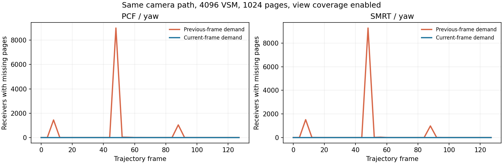

# VSM 当前帧接收者需求标记（2026-09-11）

已实现本帧深度／法线 → 接收者需求标记 → 页分配与绘制 → Resolve。首帧和布局重建不再等待上一帧接收者反馈。本报告只说明当前帧需求链路的质量结果；GPU 标记成本仍需要优化。

## 实现与边界

- `CSMShadowPass` 显式读取与 `CSMShadowResolvePass` 相同的深度和 GBuffer1；在布局 remap 后、页分配前运行 `VSMMarkReceiverPages`。实际图和标准模板的执行索引均为深度 2、法线 6、阴影 9、Resolve 10。
- 标记与采样复用 `ResolveVSMReceiver` 的屏幕密度／传统层级选择、法线重建、各层偏移、primary／parent／transition／terminal 角色及滤波覆盖。SMRT 保守标记其 PCF 回退需求，与页面是否驻留及随机相位无关。
- DXIL 反射证明标记 kernel 只读取投影、深度、法线，并写页元数据；不依赖物理池、页表或随机序列。生产 Resolve 编译时禁用需求写入。
- 每帧清除旧请求角色，普通帧保留 LRU 年龄；相机切换、重复帧和时间回退清除请求时间戳。分配器消费当前帧戳，支持帧 0。
- 接收者调试快照必须同时满足当前帧需求、页面绘制和 Resolve 已完成。重新标记会使旧 Resolve 快照失效。
- 图导入器升级至 8，沿同一阴影 Atlas 的 Resolve 输入为旧图补接深度／法线，不覆盖显式接线。标准模板已通过 Unity 图 API 保存并保留必要差异。未接线的自定义图回退 CSM。
- 保持本帧可见不透明接收者的范围；不新增透明物体、体积接收者、预测需求或页预算自适应。

## 质量验证

Unity 6000.7.0a6，D3D12，RTX 5070 Ti。沿用上一轮场景、相机姿态、灯光和轨迹：4096 VSM、1024 页、firstLevel 0、screen density 开启、target 1、bias 0、view coverage 开启、coverage transition 0.05、LOD transition 0.2。1920×1080 NativeAA／TSR，PCF 或 SMRT 4×8。每组包含静态、平移、转头及停稳；SMRT 的 BND 相位也与旧结果对齐。

对照旧实现的**相同轨迹和相同布局配置**，在 480×270 诊断网格上的缺页采样点峰值如下。它是原生图像每四像素采样一次的统计，不代表全分辨率像素总数。

| 模式／轨迹 | 上一帧需求 | 当前帧需求 |
| --- | ---: | ---: |
| PCF／平移 | 2,820 | 0 |
| PCF／转头 | 8,996 | 0 |
| SMRT／平移 | 2,857 | 0 |
| SMRT／转头 | 9,279 | 0 |

- PCF 的驻留回退归零；SMRT 的缺页标志归零，但保留少量既有采样回退：细层覆盖配置静态／平移最多 41 点、转头最多 54 点，相关点缺页标志为 0。未改变 SMRT 的射线算法或数值失败策略。
- 当前帧页需求峰值：PCF 653、SMRT 675（上一轮 SMRT 为 674，包含保守 PCF 回退需求后的差异）。两种模式均无页溢出、无最终不可用样本、无终端 L9 采样。
- 360 个详细诊断帧的页表、物理 owner、元数据、清脏状态一致。每种模式记录 512 个测量帧，静态逐帧采集详细数据，运动每 4 帧及末帧采集。未观测帧不能据此声称完全无闪动。
- 相比开启细层覆盖前的相机居中布局，覆盖窗口移动仍可能改变首选层级。这属于布局几何变化，与此次已消除的缺页回退区分。

## 验证与成本

- 独立非 NUnit 诊断：实际图／模板顺序和迁移幂等性通过；3 组 GPU 夹具覆盖传统选择、屏幕密度、SMRT，均能在帧 0 标记并分配，连续帧重标记复用页面，天空不保留旧需求且保留 LRU 年龄。
- 10,000 次稳定 CPU 参数／帧契约检查为 0 字节。临时仪表包围真实 `RecordReceiverPageRequests` 调用，第一轮预热后 7,090 次观察峰值 0 字节；独立复测继续为 0。该仪表已归档并从运行时代码移除。此结论不等于整个渲染管线零 GC。
- C# Runtime／Editor／Tests 的 Roslyn 编译与 40 个 DXC kernel 编译通过。当前 Editor 开着，**没有执行 Unity Test Framework 或 NUnit 测试**；新增测试须由用户在合适时机手动运行。

独立性能复测没有并行构建、截图、压缩或图像回读。每组预热 5 秒、采样 5 秒，正反顺序重复。单位为 GPU ms 中位数：

| 配置 | 本帧标记 | 分配 | Resolve |
| --- | ---: | ---: | ---: |
| 居中布局／256 页 A | 2.035 | 0.484 | 0.318 |
| 居中布局／256 页 B | 1.897 | 0.470 | 0.317 |
| 细层覆盖／1024 页 A | 2.577 | 0.551 | 0.321 |
| 细层覆盖／1024 页 B | 4.631 | 0.562 | 0.326 |

原先的 Resolve 含反馈，1024 页配置约 1.91–2.01 ms；现在反馈成本移入独立标记阶段，不能只用 Resolve 下降来宣称优化。标记阶段波动和较高成本仍是风险。采样器统计作用于 Editor 中的 GPU marker，整帧时序无法可靠归属于单个相机，记录器的 `comparable` 为 false；不能据此承诺单相机总帧预算或精确的整帧增量。逐帧联合统计保存在 `timing/summary.json`，没有把多个阶段的中位数直接相加当作总时间。

下一步优先做页请求去重／原子写入合并，并在可归属到单相机的 GPU 捕获中确认标记成本；保留当前逐像素需求作为质量参考，避免通过漏标细小接收者换取耗时下降。

## 复现与交接

原始采集保留在忽略目录 `Temp~/vsm-general-captures`，采集索引、前后对比、页审计、编译结果、DXIL 资源反射、性能样本及诊断源码归档于本目录。临时 Editor 工具完成后删除源文件，由 Unity 清理对应 `.meta`；场景、相机、灯光、保存的 Volume／实际 Volume stack 和 Play 状态已逐项核对恢复；多个 Volume 的枚举顺序忽略，完整集合一致。

手动回归重点：`CurrentReceiverMarking_ColdStartAllocatesSameFrameAndClearsDepartedDemand`、`VirtualShadowMapPrototypeFeedback_IsConsumedOnlyByItsCameraAndCurrentFrame`、`VirtualShadowMapPrototypeFeedback_WarmOwnershipChecksAllocateZeroBytes`、`Snapshot_RequiresBothRasterAndResolveForExactCameraFrame`、`MigrateShadowReceivers_SharesResolveInputsAndPreservesExplicitConnections`、`StandardTemplate_CompilesDrawObjectPassWithEmbeddedRenderListDescriptor`。
