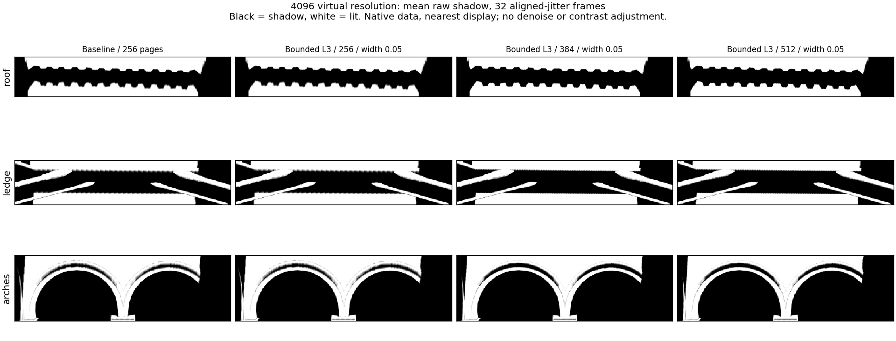

# 4096 下的细层覆盖、过渡宽度与物理页预算

本轮完成了 7 组配置、21 个阶段的实际 GPU 读回，确认目标锯齿受 **细层覆盖与细页驻留共同限制**。256 页池下只前移 L3，目标接收面仍回退到 L4；增加容量后，前移才真正带来更细的采样。0.05 的窄覆盖过渡也只有在细页可用时才有作用。

**结论：后续通用覆盖实现以 4096 虚拟分辨率、512 物理页、0.05 覆盖过渡作为质量对照，LOD 分数过渡仍保持 0.20。** 这不是本轮已经修改的产品默认值。384 页可以保住目标静帧的主要收益，但动态退层和分配成本仍逊于 512 页，不宜只凭静帧降低预算。

本轮未保留生产代码改动：实验采用固定距离 10.6620922 m 和绝对 L3，属于验证因果关系的场景原型，不能直接作为通用布局。所有临时钩子、Unity 诊断脚本与其自动生成的 meta 已撤除，生产代码仍为 `4c39274a` 的页面优先级实现。实验前保存的 **2048、原相机/光源、NativeAA TSR、16 历史样本、锐化 0.483、时间与后台设置**已逐项核对恢复；用户指定的 4096 用于本轮全部实验。

## 方法与范围

项目：VividRP_Reborn / Sponza，Camera_1，1920×1080，4096 虚拟分辨率，首层 0，最大距离 150，屏幕密度目标 1、LOD bias 0、9 比较 PCF，随机滤波关闭。未改动 TSR 的历史响应。质量采集使用临时固定曝光 EV100 12.252064，性能采集沿用现有 VSMBaselineSession。

覆盖原型只移动 L3，朝相机前方固定距离的中心接收面方向移动，保留原始 L2 窗口，并约束在 L4 内的一页保护带之内。XY 原点按世界页对齐，并有 0.25 页迟滞；其他层、深度基准和用于屏幕密度选择的真实相机位置不变。过渡实验仅改变 coverage 分量，LOD-fraction 分量始终为 0.20。

每阶段清空页池，预热至少 128 帧，对齐首帧 jitter。每配置静止 32 帧；平移 96 帧，前 64 帧按正弦沿世界 `(1.5,0,1.5)` m 往返，后 32 帧停住；转动 128 帧，前 96 帧 ±12° 往返，后 32 帧停住。共 **1,792 个计数器/帧记录，630 个完整诊断捕获帧**。静帧每帧读回，动态每四帧和末帧读回，不能排除未捕获帧的瞬态。

原始阴影与 TSR 前后颜色以原生 560×650 ROI 读回；采样层、过渡、footprint 等来自 480×270 原生采样点网格。配对捕获均核对相机姿态与 jitter。数值对照不是光线追踪真值，图像差异不能直接作为准确度分数。

## 静止结果

下表是 32 静帧中有效诊断点的中位数；footprint 为一个阴影 texel 在屏幕上的较大轴足迹。L3 是主要改善来源。

| 配置 | 屋檐 footprint / px | 横梁 footprint / px | 拱门 footprint / px | 屋檐实际粗层混合中位数 |
|---|---:|---:|---:|---:|
| 原布局 / 256 页 / 0.20 | 1.338 | 1.347 | 1.341 | 0 |
| 前移 L3 / 256 页 / 0.20 | 1.338 | 1.347 | 1.341 | 0 |
| 前移 L3 / 256 页 / 0.05 | 1.338 | 1.347 | 1.341 | 0 |
| 原布局 / 512 页 / 0.20 | 1.338 | 1.347 | 1.341 | 0 |
| 前移 L3 / 512 页 / 0.20 | 0.671 | 0.675 | 0.986 | 0.555 |
| 前移 L3 / 512 页 / 0.05 | 0.671 | 0.675 | 0.986 | 0 |
| 前移 L3 / 384 页 / 0.05 | 0.671 | 0.676 | 0.986 | 0 |

原布局的屋檐采 L4，所以其混合权重 0 并不意味着更细。前移后约 89.8% 屋檐点和 57.7% 拱门点进入 L3；仍有接收面处在 L4 覆盖范围，不能宣称消除了全部锯齿。

256 页的失败原因可从首帧用途快照直接看到：前移前 L3 的独立主请求 81 页全部驻留；前移后增到 163 页，只驻留 82 页。同时 L4 的父层请求从 44 增到 71 页。优先级仍保护父层，但留给新细节的容量不足。总请求峰值从静止 421 增到 504，动态最高 528。单独缩窄过渡不会改变页面驻留或最终采样层，256 页的两个前移版本在全部配对捕获帧中选层相同。

512 页前移版本的静帧无溢出，细层均可用；0.20 → 0.05 不改变选层/驻留，只降低实际混合的 L4 权重。屋檐粗层混合中位数从 55.5% 降到 0，coverage 控制混合的点比例从约 82.5% 降到 0。



图由 GPU 原始阴影标量生成，黑色为阴影、白色为受光，32 帧均值，显示使用最近邻，无去噪或对比度调整。未修改的最终帧 PNG 位于 `capture/*/*_static/last.png`。

## 动态与 TSR

630 个完整捕获帧内：页面编码均在容量范围内，没有两个虚拟页同时占用同一物理槽，页表与 metadata 一致，阴影数据均有限，没有无可用层的接收点，也没有整帧 CSM 回退。**无可用层为 0 不等于没有粗层回退。**

| 配置 | 平移峰值溢出页 | 转动峰值溢出页 | 平移 L9 采样点峰值 | 转动 L9 采样点峰值 |
|---|---:|---:|---:|---:|
| 原布局 / 256 | 181 | 182 | 2488 | 16 |
| 前移 L3 / 256 / 0.05 | 271 | 272 | 2488 | 16 |
| 原布局 / 512 | 0 | 0 | 0 | 0 |
| 前移 L3 / 512 / 0.05 | 15 | 16 | 0 | 0 |
| 前移 L3 / 384 / 0.05 | 143 | 144 | 2488 | 14 |

L9 计数是全屏诊断网格内的绝对计数，384 页没有新增无可用层，但仍保留了基线的动态终层退化。其原因还需进一步区分新可见需求的反馈时序和缓存压力，本轮未将它归结为单一根因。

相对原布局/256 页，384 页前移版本每个静帧最多 59,624 个诊断点变细、没有点变粗；平移捕获帧中变粗点峰值 465，转动峰值 660。因此不能只展示变细点而声称所有位置均改善。相对 512 页窄过渡，384 页静止屋檐和拱门原始阴影完全一致，但横梁中的部分 L2 点退到 L3；转动时也有部分拱门点更粗，详见 `budget384-vs-512.json`。

512 页前移版本在停止运动 31 帧后，三个目标区域的原始阴影和 TSR 前颜色均回到同 jitter 静态参考。TSR 输出仍有残差：窄过渡屋檐输出亮度 MAE 约 0.00127（平移）/ 0.00116（转动）。静止同 jitter 相位的屋檐输出 RMS 约 0.00303，与基线 0.00302 接近。不同 jitter 相位的总 RMS 反而由 0.0391 增到 0.0427，说明更细的边缘仍含更强的采样变化；本轮没有把它包装成“时间稳定性全面提高”。

`replayMissingPixels` 统计采样过程中遇到的缺页标志，可能随后已成功回退，不应直接当成最终无阴影像素。生产输出与诊断重放最大绝对误差小于 0.000489，符合 RHalf 输出量化量级。

## 性能与资源

每次 5 秒预热、5 秒测量，关闭逐帧图像读回/压缩；先正序后反序各一次。384 页另做 256 → 384 → 384 → 256 的交错对照。以下均为各次运行的 GPU 中位 ms。

| 配置 | 样本数 | 整帧 GPU | VSM 分配阶段 |
|---|---|---|---|
| 原布局 / 256，首轮与末轮 | 932 / 853 | 5.304 / 5.757 | 0.492 / 0.476 |
| 原布局 / 512 | 900 / 870 | 5.531 / 5.725 | 0.357 / 0.381 |
| 前移 L3 / 512 / 0.20 | 885 / 843 | 5.610 / 5.905 | 0.423 / 0.402 |
| 前移 L3 / 512 / 0.05 | 856 / 834 | 5.836 / 5.973 | 0.425 / 0.425 |
| 384 对照前后原布局 / 256 | 879 / 823 | 5.648 / 5.787 | 0.492 / 0.493 |
| 前移 L3 / 384 / 0.05 | 750 / 273 | 6.617 / 5.903 | 0.736 / 0.728 |

这些时序含 Editor 和其他相机影响，不能直接与用户提供的 7.3 ms 等同。384 页第二次样本明显更少，整帧波动较大；不能据此下结论说 512 在所有场景都更快。各记录器状态为 `completed_with_warnings`，原始警告与统计保存在 `timing/`、`timing384/`。

较一致的观察是：384 页静帧仍每帧新分配 4 页中位数，512 页为 0；前者分配阶段约 0.73 ms，后者约 0.40–0.43 ms。缩小容量节省显存，但在本场景增加了驻留反复和分配工作，未显示稳定的 GPU 节省。

按两个 R32_UInt 物理图集和一个 Depth32 页数组的未压缩尺寸估算，256/384/512 页分别约 48 / 74 / 98.125 MiB。512 相对基线增加约 50.125 MiB，384 增加 26 MiB。该估算不含驱动对齐、请求缓冲、页表等开销，也不是实测总显存。

## 后续推进方向

1. 将固定 L3/固定距离原型改为由相机视锥与层级尺度驱动的通用覆盖布局，保留世界页吸附、迟滞、父子覆盖与深度基准稳定；用本轮 512 页对照验证静止、平移和转动。不能将 Sponza 的 10.66 m 直接写入生产。
2. 将细层覆盖和物理页预算一起验收。优先级只能决定谁先获得页面，无法让超出容量的细页同时驻留。先以 512 页确认动态质量，再优化主请求/父层请求的有效需求与缓存周转。
3. 在细层稳定驻留之后采用独立的窄 coverage 过渡；LOD 分数过渡保持独立。低预算下的 L9 瞬态需要另外追踪反馈时序与缓存压力，继续调整 TSR 历史不能补回缺失的阴影深度。

## 验证、清理与复查

- 400 个移动相机布局检查通过：仅 L3 改变、原 L2 包含关系、父层一页保护、世界页对齐、相机选择和深度基准保持。
- 布局预热 100 次后稳定 Update 1000 次，当前线程托管分配 0 字节；接收面参数预热 100 次后调用 10000 次，0 字节。此为聚焦诊断，不是整个渲染管线全线程零 GC 认证。
- 原型与清理后的 Runtime、Editor、Tests 三个程序集均通过 Roslyn 编译，最终源文件与 Bee response 快照稳定。
- DXC：35 个生产/采样测试 kernel 通过；临时审计 kernel 另行编译通过。清理后再编译 35 个 kernel 全通过。
- 清理后 Unity 控制台检查从 13:03 UTC 起 0 个 Error。原相机、光源、AA、保存的 Volume 与有效 Volume stack 逐项一致，两个诊断器的临时 Volume 对象为 0。
- Editor 始终保留打开，未运行 Unity Test Framework。后续合入通用实现时，请在 Editor 关闭后手动运行 `VirtualShadowMapClipmapTests`、`VirtualShadowMapReceiverQualityTests`、`VirtualShadowMapSamplingTests` 和 `CascadedShadowSettingsVolumeTests`。

可复查数据：`pool-results/summary.json`（256/512）、`budget384-results/summary.json`、`frame-audit.json`、`timing-summary.json`、`restoration-checks.json`。`*.cs.txt`、`*.hlsl.probe.txt` 和 `temporary-runtime-hooks.patch` 是已撤下的诊断原型，不属于运行时。分析脚本使用同级前次实验的二进制读取函数。

完整原始浮点读回保存在本机被忽略的目录：

- `Temp~/vsm-fine-coverage/20260908_123954_120`：256 页三组。
- `Temp~/vsm-fine-coverage/20260908_124917_767`：512 页三组。
- `Temp~/vsm-fine-coverage/20260908_125612_952`：384 页一组。

从包根目录可执行：

```powershell
python 'Roadmap~/Experiments/VSMFineCoverage_20260908/analyze_pool_coverage.py' 'Temp~/vsm-fine-coverage/20260908_123954_120' 'Temp~/vsm-fine-coverage/20260908_124917_767'
python 'Roadmap~/Experiments/VSMFineCoverage_20260908/analyze_384_coverage.py' 'Temp~/vsm-fine-coverage/20260908_123954_120' 'Temp~/vsm-fine-coverage/20260908_125612_952'
```
