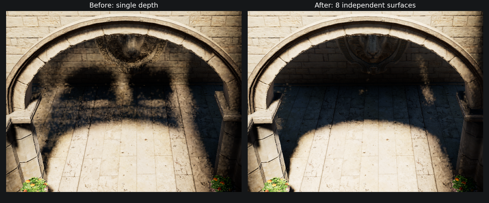

# VSM 拱门漏光修复：保留独立遮挡深度层

后续已针对残余右侧亮条推进到 16 层，见 [局部验收与修复](../VSMResidualLeak_20260912/README.md)。以下保留八层阶段记录。

本轮将实际 VSM 页池改为八层深度。截图中拱门暗部的重复亮斑已明显消除，固定 ROI 的过亮误差下降 **92.8%**。没有修改太阳角径、相机、Volume 资产或页预算；前一轮的去噪修复保留。

根因是单层深度只记录最靠近光源的表面，SMRT 的有限厚度求交无法恢复被它隐藏的拱门遮挡。最近背面原型仅小幅改善；RTAS 构建的四层前表面原型较好，但真实光栅中存在更多前景表面，四层仍会溢出有效遮挡。实际四层与八层对照后选择八层，未把深度间的空气合并成实体。

| 同一视角，32 帧均值 | 可见率 MAE | 过亮误差 | 过暗误差 |
|---|---:|---:|---:|
| 单层基线 | 0.0541385 | 0.0521063 | 0.0020322 |
| 实际光栅四层 | 0.0190486 | 0.0169381 | 0.0021106 |
| 实际光栅八层 | 0.0058435 | 0.0037445 | 0.0020990 |

参考、相机与 ROI 沿用 [前一轮独立几何对照](../VSMCorrectness_20260912/README.md)：480×270 接收网格的 `y=[100,163), x=[163,290)`，共 8,001 点；参考为每点 1,024 条三角形射线。它强制 opaque，适用于这里的实体拱门，不能作为植物 alpha 裁剪的真值。上述指标是去噪前的可见率，前后材质截图均开启去噪。组间 BND 相位不完全配对。`metrics.json` 记录完整抓取目录；`receiver-means.npz` 保留数值。结果仍是离散深度近似，不宣称所有视角零漏光。

实际实现使用同名 R32_UInt 静态、动态池的八个 texture-array slices。caster 用逐层 InterlockedMax 插入最近的不同深度，重复值不消耗层数；Meshlet 与 Unity 兼容 caster 共用这一写入函数。第零层保持原有最近深度，硬阴影与 PCF 继续读取它。SMRT 在前层未命中且射线仍在前层后方时，检查其他层；静态和动态深度分别求交，不能逐层取 max 后丢掉另一池的隐藏遮挡。已有跨页映射复用、跨 clipmap 连续光程和每层半纹素厚度不变；新增层不延伸 gap 历史。

清页内核清除动态池全部层，仅在静态页 dirty 时清除其全部层；页滚动、失效和 owner 分配共用原有元数据。资源配置比较包含层数，稳定配置复用已有纹理。调试采样及测试夹具已同步为数组纹理。没有增加第二遍 caster draw 或引入运行时 RTAS。

成本明确增加：每池每页从 64 KiB 变为 512 KiB。当前 256 页的静态、动态深度池合计 **32 → 256 MiB**，预算上限 1024 页时 **128 → 1024 MiB**，不含已有 DSV、页表等资源。该布局应用于 VSM 池，即使关闭 SMRT 也仍占用这些层。四层到八层的屏幕诊断平均 DDA 格访问从 84.68 降为 76.41，但深度对读取从 266.99 增至 409.21（每对分别读取静态与动态）。这是相同 480×270 接收网格、含不可见像素的算法计数，不能当作 GPU 毫秒数；本轮未测得完整帧 GPU 时间。后续压缩/按需分配及采样优化应以八层结果为质量基准。

几何边界检查覆盖 14 类场景 × 4 种分辨率、7.1°、8 steps、50 m，共 698,880 条射线。float32 跨层模型与独立 float64 几何参考相比：漏遮挡 **5640 → 3642**，误遮挡 **2298 → 2496**。新增 198 次误遮挡均来自 `gap_hidden` 粗纹素的隐藏细层覆盖；薄片、细杆、分离层、接触和斜薄片的误遮挡数量不变。额外层恢复了真实遮挡，但没有解决栅格覆盖误差；不以本修复宣称粗层几何已完全准确。此新增模型没有宣称全量 GPU/CPU 逐射线一致，实景及以下夹具则确实在 GPU 执行。

验证结果：

- DXC 44/44 计算入口通过；Runtime、Editor、Editor.Tests Roslyn 编译通过。
- 独立 GPU 光栅夹具调用生产 `VividInsertVSMDepth`，每像素 1,024 个重叠片元，三种顺序均得到正确的八层去重排序；保留 ZWrite On / ZTest LEqual 的 caster 状态。
- 生产 SMRT 求交夹具 32/32：八个深度层 × 静态/动态 × 隐藏命中/空隙保持。生产清页内核同时通过 clean/dirty 页全部层检查。
- 资源准备按现场配置预热 64 次、测量 256 次，`GC.GetAllocatedBytesForCurrentThread()` 为 **0**，静态池句柄保持同一实例。不代表所有渲染线程的 Profiler 审计。
- 相机、太阳、Edit mode、Time、runInBackground 及 Volume 状态已核对；临时场景对象为 0，没有保存用户原有的脏场景。

Editor 保持打开，未运行 Unity Test Framework / NUnit。用户应手动运行 `VirtualShadowMapSamplingTests`、`VirtualShadowMapClipmapTests`、`VSMDebugPassTests`、`VividRenderPipelineAssetGpuDrivenTests`，以及前一轮去噪相关 `CSMShadowResolvePassTests`。导入阶段仍曾出现已有的 HZBGenerate / ColorPyramid / GPUMeshletCulling UAV 上限错误，不能据此宣称整个工程控制台无错。

临时探针源代码归档为 `.txt`，独立 GPU 命令及输出在本目录。执行归档命令需要先恢复其所引用的临时诊断 shader；Unity 自动生成 `.meta`。清理前对本任务四个临时源文件及其四个 Unity `.meta` 逐项备份并核对 SHA256，清理清单位于 `Temp~/vsm-backfaces/cleanup-backup/manifest.json`。这些文件不留在 Editor 编译路径中。
