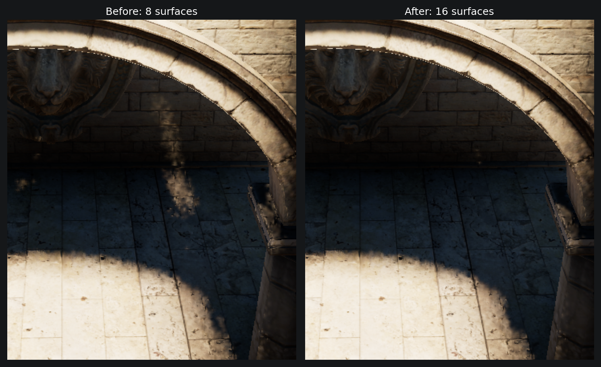

# VSM 残余亮条修复（2026-09-12）

本轮基于 `e9dd0a39` 的八层 VSM，针对用户箭头指向的右侧竖向亮条继续修复。实际页池容量改为 **16 层**，求交规则保持不变。实际光栅的 32 帧对照中，指示点错误可见率 **0.078125 → 0**；局部亮条区域平均误差 **0.0115269 → 0.0001371**，下降 **98.8%**。画面中原有亮条已消失；不以此宣称所有像素或所有场景误差为零。

局部验收使用同一 1920×1080 相机，接收网格为 480×270。指示点为网格 `(267,118)`，对应被采样的屏幕像素 `(1070,474)`（GPU 底部原点）；亮条 ROI 为 `x=[260,275), y=[110,148)`，共 570 点。此前独立 1,024 rays/point 三角形参考在该 ROI 中全部遮挡。保留原相机、7.1° 太阳角径、SMRT 4 rays / 8 steps / 10 m、2048 分辨率与 256 页预算。

逐射线检查确认是深度容量遗漏。指示点的一条漏光射线在实际几何上于 `t=3.784 m` 命中；对应 DDA 格区间为 `[3.389,4.248] m`。该纹素八个保存表面的轴向距离却都在 `[9.307,13.394] m`，更近的遮挡被挤出了列表。独立几何枚举在同一纹素检出 `t=4.227 m` 的可相交前表面。见 `ray-example.json`。这条射线的遮挡位于配置光程以内，继续增大光程无法补回丢失的数据。

为确定容量方向，使用独立 RTAS 在当前物理纹素上枚举前后两面的表面深度，按最近不同深度排序，再分别限制读取 8、10、12、16 层。没有只保留 front-facing 面，也没有丢掉薄片背面来节省层数。

| 原型，32 帧 | 指示点错误可见率 | 亮条平均误差 | 平均误差超过 1% 的像素 |
|---|---:|---:|---:|
| 8 层 | 0.078125 | 0.0115269 | 179 |
| 10 层 | 0.0390625 | 0.0037418 | 70 |
| 12 层 | 0.0078125 | 0.0011376 | 22 |
| 16 层 | 0 | 0.0001371 | 0 |

选择已测配置中的 16 层，再验证生产光栅。生产去噪前的局部误差峰值为 0.015625（仅一个点的 32 帧均值超过 1%）；去噪后的实际阴影峰值为 0.005741，超过 1% 的点为 0。图像使用实际去噪结果，表中的容量原型与主要数值则来自原始求交。各组采样相位不完全配对；保留帧参数和数据，未以单张截图代替数值检查。完整抓取路径在 `metrics.json`，均值在 `receiver-means.npz`。

生产修改仅增加 C# 与 HLSL 的层容量常量。现有原子插入、层间独立求交、静态/动态合并、dirty 清页与资源层数检查自动覆盖新增层。新增固定的密集遮挡回归：前 15 个表面不与斜射线相交，第 16 个隐藏表面应当遮挡；同时扩展原有每层/每池的空隙测试，避免新增测试中的前景深度随层数增长落到隐藏表面后方。

成本：当前 256 页的静态、动态深度池合计 **256 → 512 MiB**；1024 页上限对应 **1 → 2 GiB**，均不含原有 DSV 与页表。该场景诊断的平均 DDA 格访问 **76.41 → 59.03**，深度对读取 **409.21 → 381.18**，因为更多射线更早命中；每对包含静态和动态读取。这不是完整 GPU 帧时间，新增层的清理、光栅写入与显存成本不能被这些计数抵消。本轮未测可靠 GPU 毫秒数。固定容量仍是有界表示，后续压缩或按需分层须以该局部质量结果回归。

验证：DXC 44/44；Runtime、Editor、Editor.Tests Roslyn 编译通过。独立 GPU 光栅夹具直接调用生产插入函数，每像素 1,024 个重叠片元，三种提交顺序均得到正确的 16 层去重排序。生产求交 64/64（16 层 × 静态/动态 × 隐藏命中/空隙），生产 clean/dirty 清页检查通过。资源准备预热 64 次、测量 256 次，托管分配为 0，已有纹理句柄复用；不是全线程 Profiler GC 结论。

场景相机、太阳、Volume、Edit mode、Time、runInBackground 已核对，临时场景对象为 0，没有保存用户脏场景。临时四个源文件及 Unity 自动生成的四个 `.meta` 均在归档、逐项备份和 SHA256 校验后清理。源码副本与 GPU 验证命令保留在本目录，诊断复制源需按其原路径恢复；`.meta` 由 Unity 自动生成。逐射线的八层基线复现应使用上述基线提交。

Editor 保持打开，未调用 Unity Test Framework 或 NUnit。用户需手动执行 `VirtualShadowMapSamplingTests`，尤其是新增 `SMRT_DenseForegroundStackDoesNotDiscardTheArchOccluder`，以及 `VirtualShadowMapClipmapTests.PageBudget_ResizesAllPhysicalResourcesAndReusesTheStableConfiguration`。编译通过不等于这些 Unity 测试已经运行。
