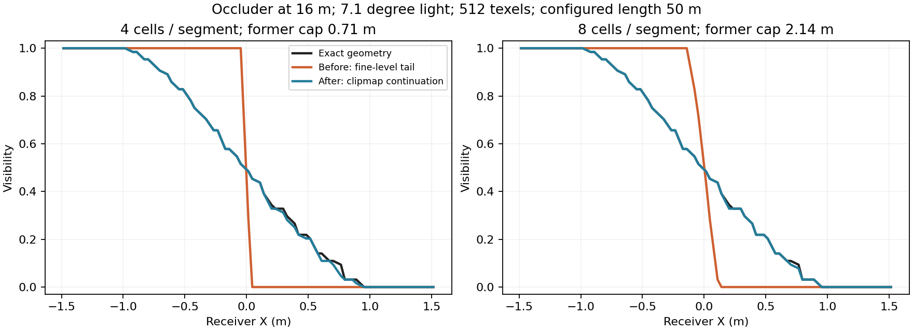

# SMRT 光程续接验证 · 2026-09-11

已消除由细层 texel 尺寸和 4–8 次采样预算触发的隐式光程截短。同一条光线现在按连续的绝对距离区间跨 clipmap 追踪，直至配置的最大世界长度。原来的有限 slab + 单格 gap 求交规则保持不变。

**正确性与页覆盖验证通过；性能闭环尚未完成。** 50 m Sponza 配置的 Resolve GPU 标记由约 0.39 ms 增至约 5.0 ms，不能作为等成本替换。远段粗层还保留单层深度和亚像素几何误差。

## 改动与边界

- 原公式 `min(maxLength, (budget - 2.001) / sqrt(2) * worldTexel / tanRadius)` 现在决定中间段的结束位置，达到该位置后继续进入更粗层，保留原光线方向、法向偏移、接收者平面抖动和深度偏移。
- 各层使用自身滚动平移与深度尺度重投影；下一段从上一段结束距离开始，不从接收者重新出发，也不跨层传递 gap 历史。
- 只有配置的最大长度触发既有的平行光尾段。这里的长度是沿主光轴的世界距离；这不是无限长度的几何光线，也不是完整复刻 Unreal SMRT。
- 最末可用层会按剩余位移增加 DDA 单元预算，以走完整个配置长度。4/8 现在是中间段的单元上限，不是整条光线的读取上限。
- 完整采样支持集逐层验证，结果不依赖随机射线相位。几何范围不足或页面不可用仍显式返回不可用，并走现有层级/PCF 回退。
- 当前帧按无偏接收者位置标记各层支持集，包含细层法向偏移及 PCF 起点范围；需要续接的层带 primary 需求标志。标记不读取物理深度池、页表或 BND 资源。
- 运行时 C# 仅更新两条参数说明，没有新增托管热路径。新增两项 SamplingTests 覆盖滚动/深度重映射、连续区间及续接需求优先级。

## 独立几何与真实 GPU

448 组、5,591,040 条射线：14 个解析场景，64/128/256/512 分辨率，0.5°/1°/7.1° 光源直径，4/8 单元预算，50 m 光程；额外覆盖 10 m、独立 XY 滚动、不同深度尺度/偏移及仅剩 1–2 层的终端情况。

真值沿用 [上一轮几何对照](../VSMSMRTGeometry_20260911/README.md) 的双精度 ray/AABB 与 ray/plane；解析真值曾与显式三角形求交独立校验。本轮重新执行该 oracle 检查。float32 CPU DDA 与生产 HLSL 并不作为几何真值。

生产 shader 在 RTX 5070 Ti / D3D12 / Unity 6000.7.0a6 上执行：**可见性不一致 0、深度读取计数不一致 0、完整驻留支持集失败 0**。终端高预算场景最多读取 135 个深度单元/射线。

以下统计限定为居中、层数充足、50 m 的常规组合，误遮挡/漏遮挡均除以该场景总射线数。完整数据见 [geometry-summary.csv](geometry-summary.csv) 和 [metrics.csv](metrics.csv)。

| 场景 | 误遮挡：旧 → 新 | 漏遮挡：旧 → 新 |
|---|---:|---:|
| 16 m 远处薄片 | 1.605% → 0.045% | 1.638% → 0.000% |
| 接触遮挡 | 0 → 0 | 0 → 0 |
| 细杆 | 0.118% → 0.084% | 0.886% → 1.018% |
| gap trap | 0.804% → 1.014% | 0.377% → 0.198% |
| gap hidden | 0.254% → 0.560% | 1.007% → 0.924% |

细杆及 gap 场景说明跨层续接并不消除表示误差，个别指标会退步。没有以修改求交规则或 bias 掩盖这些结果。



该图固定 512 texel、7.1° 光源、50 m 配置；旧实现实际只沿采样方向前进约 0.71 m / 2.14 m，随后转为平行尾段。新版的半影形状接近独立几何真值。

## Sponza 场景与页预算

4096 虚拟分辨率、1024 物理页、通用视锥覆盖、coverage transition 0.05、LOD transition 0.2、SMRT 4×8、7.1° 光源、50 m、1920×1080 NativeAA，固定曝光。每版静止 32 帧、平移 96 帧、转向 128 帧；动态场景每四帧加末帧做 GPU 快照，共 **90 份/版，180 份配对 GPU 快照**。相机轨迹、投影、抖动和 256 帧随机序列相位完全一致。

| 指标 | 修复前 | 修复后 |
|---|---:|---:|
| 页表/元数据/物理归属不一致 | 0 | 0 |
| 页预算溢出、最终不可用、整条 PCF 回退 | 0 | 0 |
| 最高本帧请求页数 | 671 | 675 |
| 静止平均深度读取/接收者 | 22.09 | 97.13 |
| 平移平均深度读取/接收者 | 20.64 | 92.90 |
| 转向平均深度读取/接收者 | 20.54 | 90.45 |

单次软估计的 footprint 失败数保持一致，均由现有父层覆盖接住，没有扩散为整条 PCF 回退。参见 [scene-summary.json](scene-summary.json) 和两版 `scene-*/page-audit.json`。

诊断重放与实际输出并非严格逐像素相同：新版 11,218,303 次有效接收者观测中 3 次差异超过 0.001，最大差异 0.25；各轨迹平均绝对误差为 3.73e-7–5.33e-7。旧版最大约 0.000488。差异原因尚未单独定位，不能宣称真实场景 bit exact。离线几何 GPU 对照的 0 差异是另一项独立验证。

另以孤立 GPU 诊断检查本帧标记→分配→清除：PCF、density、SMRT 共 3 组，冷帧请求 36 页、重复帧请求 36 页，天空帧清除需求并保留 LRU 年龄；SMRT 续接层 primary 标志通过。断言在分配器清除请求标志之前执行。见 [marking.json](marking.json)。

## 性能代价

单独计时，无截图读回；每阶段预热 4 秒、采样 4 秒，顺序为 10/50/50/10 m。先测精确的修复前 shader，再恢复最终实现测量；源文件已恢复并核对哈希。

| GPU 标记 | 修复前两轮中位数 | 修复后两轮中位数 |
|---|---:|---:|
| Resolve，10 m | 0.829 / 0.385 ms | 4.009 / 4.237 ms |
| Resolve，50 m | 0.388 / 0.385 ms | 4.970 / 5.022 ms |
| MarkReceiverPages，50 m | 3.828 / 3.987 ms | 4.873 / 4.846 ms |

这些是 Editor 的 GPU 标记诊断，**不是经认证归属到单相机的整帧性能**。既有 harness 将 runs 标为 `completed_with_warnings`、`comparable=false`；整帧计时含缺失/极低值，未据此给出 FPS 或总 GPU 加速比。保留所有原始样本、问题标志与汇总于 [timing](timing/)，未过滤选择有利轮次。

下一步优先降低跨层重复变换、页表访问和分支发散的代价，同时以本轮几何误差及 180 份页面快照作回归门限；然后单独解决远段细几何与 gap 误差。不能通过重新缩短光程、提前改用平行方向或随机缺页回退来恢复旧耗时。

## 验证与复现

- 最终 DXC：CSMShadowResolve + SamplingTests 全部 41 内核通过。
- 最终 Roslyn：Runtime、Editor、Editor.Tests 独立编译；结果见 `validation/csharp-validation.json`。
- Editor 正常运行，按仓库规则未启动 Unity Test Framework。仍需用户手动执行 `VirtualShadowMapSamplingTests`，尤其新增的两个 `SMRT_Continuation*` 测试。
- 临时诊断源码以 `.txt` 归档，核对归档一致后移除本次源码及其自动生成元数据；场景、相机、灯光、Volume、播放状态与运行前一致，见 `validation/state-restoration.json`。

在包目录中运行：

```powershell
python Roadmap~/Experiments/VSMSMRTContinuation_20260911/path_geometry.py prepare
python Roadmap~/Experiments/VSMSMRTContinuation_20260911/probe.py install
# Unity Refresh；Edit Mode 下运行 Tools/VividRP/Diagnostics/Run SMRT Path Reference
python Roadmap~/Experiments/VSMSMRTContinuation_20260911/path_geometry.py verify
python Roadmap~/Experiments/VSMSMRTContinuation_20260911/summarize.py
```

`prepare` 会重建 Temp 下的数据并清除上一次 GPU 输出，不能在 GPU 尚未执行时调用 `verify`。约 559 万条 GPU 输入/原始输出留在 `Temp~/smrt-path`；本目录保存紧凑汇总、数据生成器及可安装的诊断源码。
