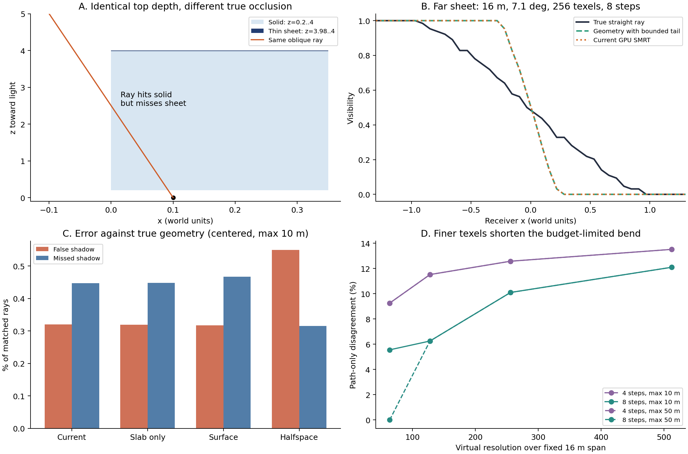

# SMRT 几何准确性对照 — 2026-09-11

**决定：继续以现有有限厚度 slab 为求交基线，暂保留一格补洞；本轮不替换生产 shader。** 零厚度表面会增加斜面漏遮挡，深度半空间会把薄片当成实体。补洞既有修复隐藏层的收益，也有断层误遮挡，不能仅凭“命中更多”判断正确。下一步优先处理**细纹素与固定步预算共同截短光程**的问题，再评估需要哪些几何信息约束补洞。

这是求交核心的独立几何对照，不是最终画质验收。全部页面完整驻留；本轮没有证明此前实景中剩余 SMRT fallback 已解决，也没有测量 GPU 性能。



## 1. 真值与实验范围

- 几何真值直接使用双精度射线/AABB、射线/有限平面求交，不读取深度图，也不调用 DDA 或候选求交公式。
- 额外将几何转为显式三角形，用 Möller–Trumbore 交叉校验 **14,336 条几何射线**；从光源方向发射另外 **14,336 条射线**核对深度生成。包括明确的平行射线、远遮挡和薄片/实体歧义断言。
- 分别计算真实直线光线、采用当前截短路径的折线几何真值。后者在 `L` 之后沿主光轴继续；两者之差是路径近似的误差，不能归给交点判定。
- 深度图通过几何在纹素中心的最高表面生成，再编码为 R32 float 位模式并上传到 R32 UInt 物理池。相同深度图、相同输入的成对几何用于证明单层深度表示的信息损失；没有把某个深度求交候选当成几何真值。
- GPU 对照的 current 分支直接调用生产 `TryTraceVSMSMRTRay`，使用真实页表、元数据检查和静态/动态深度加载。候选只改变命中规则，保持 DDA、步预算、尾段和输入一致。

共 **408 组 × 12,480 条 = 5,091,840 条射线**。每组 195 个接收位置，每位置 64 个确定性等面积光盘样本；所有规则及真值使用相同射线。因此逐射线差异不是随机相位或 TSR 的差异，64 样本的可见率也不应解释为无限样本面积光积分。

| 维度 | 设置 |
|---|---|
| 几何 | 空场、平接收面、斜接收面、陡接收面、薄片、实体块、接触薄片、远薄片、细杆、不相连层、重叠层、斜薄片、补洞陷阱、隐藏层，共 14 类 |
| 地图 | 固定 16 × 16 世界单位，分辨率 64/128/256/512，纹素宽度 0.25/0.125/0.0625/0.03125 |
| 光源角径 | 0.5° / 1° / 7.1°，方向斜率为 `tan(角径 / 2)` |
| 步数 | 4 / 8 |
| 最大光程 | 主对照 10；远薄片另有 50 的对照 |
| 真实路径 | 沿光盘方向连续延伸，几何范围足够由 64 的轴向查询长度覆盖 |
| 截短路径 | `L = min(maxLength, (steps − 2.001) × 0.70710678 × worldTexel / tanRadius)`，之后为平行尾段 |
| 接收者 | 主对照放在纹素中心，模拟 PCF 开启后的求交起点；两类斜接收面另测未对齐起点 |
| 偏置 | 统一轴向偏置 `0.01 × worldTexel`；没有 normal bias，也不随规则调参 |
| 其他 | 单投影，整个地图为一个完整有效页，动态深度清零；不混入缺页、过渡、TSR、BND 和实景 raster bias |

主对照 336 组；未对齐接收者 48 组；远薄片最大光程 50 的补充对照 24 组。小型地图用于控制世界纹素尺度，不代表把产品 VSM 限制为 512 分辨率。

## 2. 四种规则的结果

`surface` 表示当前纹素前深度到射线起点的轴向距离，`[enter, exit]` 是 DDA 所访问纹素的区间。所有规则共享当前平行尾段约定。

| 规则 | 相对当前实现的变化 | 真实直线：过遮挡 | 真实直线：漏遮挡 | 折线几何：过遮挡 | 折线几何：漏遮挡 |
|---|---|---:|---:|---:|---:|
| current | `surface > enter`，表面背后 0.5 纹素厚度与区间相交，含现有一格补洞 | 0.31994% | 0.44714% | 0.14251% | 0.24711% |
| slab_only | 相同有限厚度，取消补洞 | 0.31958% | 0.44779% | 0.14216% | 0.24775% |
| surface | 厚度归零，取消补洞 | 0.31694% | 0.46713% | 0.13951% | 0.26709% |
| halfspace | 访问纹素时仅要求 `surface > enter`，取消区间退出约束和补洞 | 0.54988% | 0.31536% | 0.36666% | 0.10953% |

这些百分比的分母是主对照全部 **4,193,280 条射线**；不是仅以受影响像素或真遮挡射线为分母。场景和参数等权，包含平坦及空场，不能据此宣称实景平均误差不到 1%。例如 current 的单接收位置最大可见率误差达到 **0.671875**。完整计数、真遮挡数、每位置平均及最大误差保存在 `metrics.csv`。

所有主对照与补充对照的 unavailable 均为 0。**GPU 四规则共 20,367,360 次结果与 float32 离线实现一致，差异 0**。这只证明执行一致性；几何正确性由前述独立几何真值判断。

## 3. 能据此做出的几何判断

**薄片与实体无法由单层深度唯一辨别。** `thin_sheet` 和 `solid_block` 的顶面、深度图以及四种规则的输出逐项相同，但成对的 299,520 条真实直线光线中，有 **2,034 条**的真实遮挡不同。半空间规则在实体侧面上获益，在相同深度图的薄片上产生假遮挡。当前规则准确匹配这组薄片的折线几何，却会漏掉实体的部分侧面。

**补洞也存在同样的歧义。** `gap_trap` / `gap_hidden` 的深度图及算法输出相同，实际几何只改变被上层遮住的低层延续；真实直线遮挡有 **3,534 条**不同。与 slab_only 相比，当前补洞在陷阱场景改变 21 条射线：6 条修复、15 条误遮挡；在隐藏层场景改变 21 条：全部修复。当前单格历史没有足够信息识别这两种几何。因此既不把补洞当作“几何修复真值”，也不在本轮全局删除。

**零厚度表面不是无条件更准确。** 它减少少量过遮挡，但在斜薄片的单点采样深度上增加漏遮挡。有限厚度还承担离散深度表面的容差作用。当前 0.5 纹素不是已证明的最优厚度，本轮没有做厚度参数寻优。

**接收起点与求交规则必须分开评估。** 在统一极小轴向偏置下，两类斜面使用纹素中心起点均为 0 自遮挡；未对齐起点则分别有约 52.31% 和 51.43% 假遮挡。这个压力场景说明采样深度与接收平面的起点不一致会污染规则比较。这里没有使用完整生产偏置，不能把该数字直接认作产品 PCF 关闭时的错误率。

## 4. 更优先的问题：截短的路径

16 米远薄片的 **48 组**结果中，current 与折线几何真值逐射线完全一致；与真实直线光线的差异来自路径近似。7.1°、8 步时：

| 分辨率 | 最大长度 10 下的 L | 最大长度 50 下的 L | 真实/折线路径差异（max 50） |
|---|---:|---:|---:|
| 64 | 10.0000 | 17.0939 | 0 / 12,480 = 0% |
| 128 | 8.5470 | 8.5470 | 780 / 12,480 = 6.25% |
| 256 | 4.2735 | 4.2735 | 1,260 / 12,480 = 10.10% |
| 512 | 2.1367 | 2.1367 | 1,509 / 12,480 = 12.09% |

粗纹素时提高最大长度能够覆盖远遮挡；进入步预算约束后，单独提高最大长度无效。增加分辨率同时缩短可弯折的世界光程，远处半影反而收紧。图 B 中橙线与绿色折线真值重合，不能因它们重合就声称真实半影正确。旧实验把参考距离也截到算法上限的做法，在本对照中已明确拆开。

不同分辨率下中心对齐会改变实际接收起点，因此这是固定标称位置及固定几何下的系统敏感性对照，不是严格固定连续射线起点的数值收敛证明。每组的真值都从该组实际 GPU 起点重建。

## 5. 下一步顺序与验收标准

1. **先设计有明确物理光程含义的路径方案。** 在现有页预算/细层覆盖框架内，比较细层近段与粗层远段的接续等方案；继续使用真实直线几何对照。需要同时记录远薄片半影、细杆、接触区域、页需求、fallback 和 GPU 时间，避免用更短光程掩盖预算不足。本轮只明确问题，不提前选择接续算法。
2. **再约束补洞所需的几何证据。** 成对同深度场景必须保留为反例。仅有当前单层深度时应承认收益/误差取舍；如增加斜率、连通性或额外层信息，须同时改善隐藏层与断层陷阱，不能只看漏遮挡下降。
3. **最后接回实景闭环。** 新候选应在独立几何误差通过后，再检查 Sponza 的剩余有效页 fallback、当前帧需求、物理页压力及帧时间。此处没有以合成均值替代实景验收，也未评估 Unreal 的完整 slope-extrapolation 射线调度。

本地 Unreal 模板 `Engine/Shaders/Private/VirtualShadowMaps/VirtualShadowMapSMRTTemplate.ush` 使用历史深度、相对深度容差及可选斜率外推，其采样方向/调度也不同。本实验的 halfspace 只是受控候选，**不是 Unreal 算法复现或优劣结论**。

## 6. 复现

依赖：Python 3、NumPy、Matplotlib，Unity 项目已导入当前包。脚本从自身位置解析包目录；输出位于包内 `Temp~/smrt-geometry`。当前验证环境是 Unity 6000.7.0a6 / D3D12 / RTX 5070 Ti。

```powershell
python Roadmap~/Experiments/VSMSMRTGeometry_20260911/geometry.py prepare
python Roadmap~/Experiments/VSMSMRTGeometry_20260911/probe.py install
```

让 Unity Refresh，等待脚本导入；在 **Edit mode** 执行菜单 **Tools / VividRP / Diagnostics / Run SMRT Geometry Reference**。这是独立的同步 GPU 诊断，不使用 Unity Test Framework，也不修改场景或 Volume。完成后确认 `Temp~/smrt-geometry/gpu-status.txt` 为 `completed=408 error=none`。

```powershell
python Roadmap~/Experiments/VSMSMRTGeometry_20260911/geometry.py verify
python Roadmap~/Experiments/VSMSMRTGeometry_20260911/summarize.py
python Roadmap~/Experiments/VSMSMRTGeometry_20260911/probe.py remove
```

再次让 Unity Refresh。安装/移除只处理两个已知临时探针源文件；`.meta` 由 Unity 自动生成和删除。prepare 会使旧 GPU 成功结果失效；改输入后必须重新执行 GPU 菜单。候选 shader 为归档快照；生产接口/算法更改后需审核候选 DDA 与规则差异，GPU/CPU 不一致会使 verify 失败。

## 7. 文件与验证

- `geometry.py`：独立几何真值、三角形交叉校验、深度生成、固定射线、离线候选、逐射线 GPU 核验。
- `VSMSMRTGeometryProbe.cs.txt` / `.compute.txt`、`probe.py`：可重复安装/移除的 Editor GPU 夹具；不进入产品热路径。
- `manifest.json`：每组参数、深度 hash 与路径差异；`metrics.csv`：逐组/规则/真值指标；`curves.csv`：代表性可见率曲线。
- `summary.json`：聚合计数、同深度图反例、源码 hash、基线 Git revision 与 GPU 环境；`gpu-validation.json`：全部逐射线一致性结果。
- `summarize.py`、`comparison.png` / `.svg`：汇总与可导出图表。
- `validation.json`：DXC、Roslyn 和现场清理/状态核验结果。

两个 GPU 入口已通过 DXC `cs_6_2`；运行时 current 分支包含生产 shader。Roslyn 编译 Runtime / Editor / Editor.Tests 均通过，编译期间源文件与 Bee response 稳定。Unity Editor 处于打开状态，依照仓库要求未运行 Unity Test Framework；如需回归现有 `VirtualShadowMapSamplingTests`，请用户手动运行，或关闭 Editor 后执行批量测试。
