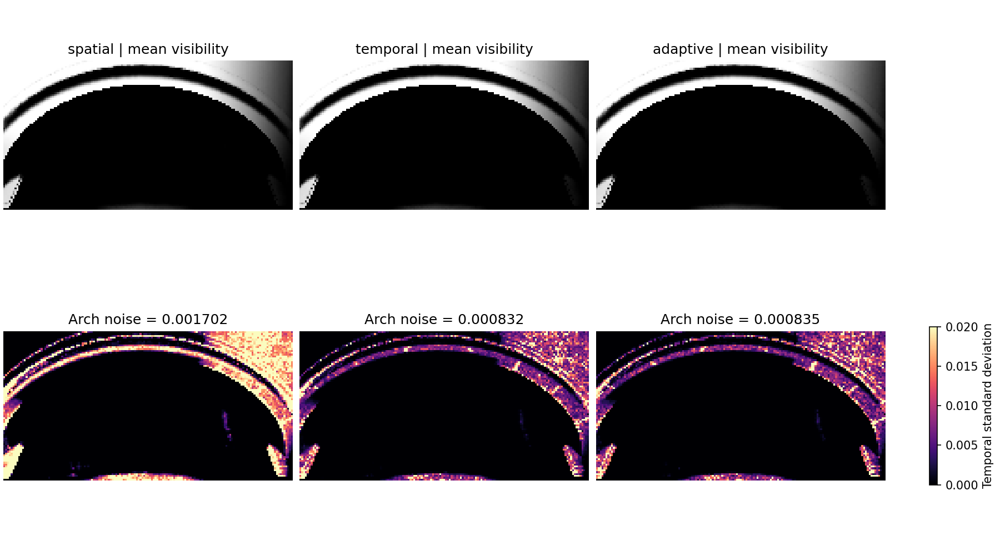

# VSM SMRT 短历史与自适应射线（2026-09-12）

已经接入生产路径。延续 16 层静态/动态深度及既有几何求交规则，空间滤波后的拱门噪声再降低约 51%，无回读 GPU 计时中位数降低约 6.9%。

## 实现

- `Screen Space Denoise` 下增加 `virtualShadowMapSMRTTemporalDenoise` 和 `virtualShadowMapSMRTAdaptiveRays`，两者默认打开，只在 VSM SMRT 软阴影有效时使用。不依赖 TAA/TSR。
- 时间累积合并进原纵向滤波，仍是横向 + 纵向两次 dispatch。当前帧必须实际追踪射线；没有零射线复用模式。
- 每个相机独立保存阴影/有效历史长度/八面体法线，以及 R32 线性深度。重投影使用前次实际写入历史的抖动后 VP；逐个验证四个双线性样本的深度和法线，接受权重不足 99% 时拒绝历史。
- 有效历史长度上限为 4，稳态新帧权重为 1/4。这是带裁剪的短 EMA，不是精确四帧滑动窗口。当前帧邻域范围裁剪历史；亮暗变化超过 0.2 时立即重置年龄。整块新亮/新暗区域当帧清除旧结果。
- 历史断帧、尺寸变化、显式历史重置、灯光方向/角度、接收者偏移、SMRT 参数、质量/布局设置变化都会拒绝历史。VSM 在栅格阶段失败时，不把 CSM 回退结果写进 SMRT 历史。
- 历史年龄达到 3，且可见度小于 0.001 或大于 0.999 时使用 2 条射线；半影、新显露区域和无效历史保留配置的 4–8 条。每 8 帧一次错开像素的满预算刷新。
- 本帧采样开始前决定射线数，再生成该数量的完整圆盘/接收者分层集；没有按前几条射线结果提前终止。页覆盖需求与光程、层级求交规则保持原有约束。

1920×1080 每相机新增 `(RGBA16F + R32F) × 2` 历史纹理，约 **47.46 MiB**。16 层 VSM 深度池仍是之前的 512 MiB（256 页）；本次没有增大页预算。

## 同机位质量与工作量

Unity 6000.7.0a6，DX12，RTX 5070 Ti，1920×1080，AA None；VSM 2048、256 页、16 深度层，SMRT 4 射线/8 步/10 m，光源角直径 7.1°。相机及场景内容与上一轮漏光修复基准相同。

三组分别预热 64 帧、捕获 32 帧。沿用上一轮独立三角形 RTAS 的 1024 射线参考和同一拱门 ROI（8001 点）。指标来自实际输出；图像采集和工作量审计在生产 resolve 之后执行。

| 方案 | 拱门帧间噪声 σ | 拱门参考 MAE | 射线尝试/接收者 | 深度对读取/接收者 | GPU 中位数 ms |
| --- | ---: | ---: | ---: | ---: | ---: |
| 原空间双边滤波 | 0.0017022 | 0.0055781 | 5.485 | 381.24 | 13.143 |
| 短历史，固定射线 | 0.0008324 | 0.0054542 | 5.485 | 381.19 | 14.345 |
| 短历史，自适应射线 | 0.0008345 | 0.0054378 | 3.594 | 234.82 | 12.232 |

工作量中的射线尝试包括层级混合与重试，因此可能超过配置的每次追踪射线数。自适应相对原方案减少 **34.5%** 射线尝试和 **38.4%** 深度对读取。固定射线短历史与自适应短历史的噪声基本相同。

用户箭头点（全分辨率 GPU 坐标 1070,474）在三组的 32 帧中均为 **0 可见度**。原漏光条带 570 点中，自适应结果均值为 0.00004097、最大时间均值 0.0027048，独立几何参考为 0。没有用阴影膨胀或放宽粗层厚度来取得该结果。

[完整最终画面](scene.png)、[质量及工作量数据](metrics.json)、[接收者均值/噪声数组](receiver-means.npz)。

## 独立 GPU 计时

另做两轮 `spatial → temporal → adaptive`，每阶段预热 64 帧、记录 128 帧，共每方案 256 个样本。计时阶段不做纹理回读、额外审计 dispatch 或逐帧 JSON 写入；使用 `VSM.Resolve` GPU profiling sampler，覆盖接收者 resolve 和滤波。

| 方案 | GPU 中位数 ms | GPU 均值 ms | P10–P90 ms |
| --- | ---: | ---: | ---: |
| 原空间滤波 | 13.143 | 13.275 | 11.671–14.943 |
| 短历史，固定射线 | 14.345 | 14.276 | 12.026–16.026 |
| 短历史，自适应射线 | 12.232 | 12.593 | 10.986–14.822 |

自适应相对原空间滤波的中位耗时降低 6.9%，相对固定射线短历史降低 14.7%。编辑器环境仍有波动，这不是整帧帧率提升。完整样本见 [timing.json](timing.json)。

## 回归与验证边界

- 生产历史重投影/预算函数：12 种 GPU 用例通过，包括均匀亮/暗、半影、年龄不足、深度/法线失效、越界、相机背面、部分双线性覆盖、周期刷新及禁用。
- 生产纵向短历史内核：8 种 GPU 用例通过，包括新亮/新暗立即响应、常量保持、全局失效、深度/法线失效、相机切换到越界及天空。
- 生产滤波内核移动边缘：水平/垂直 × 每帧 1/4 像素，共 96 帧。最大等效延迟 0.5967 像素；原空间滤波支持范围外的残留为 0。此项是合成移动阴影测试，并非整个动态场景的运动录像。
- 2、4、5、6、7、8 射线：各 256 帧 GPU BND 分层和接收者支持范围检查通过。测试 compute 显式使用生产的 Native16Bit/DXC 编译要求。
- 新历史资源配置、相机状态查找与实际纹理复用：预热 64 次，测量 256 次，当前线程 0 字节托管分配，句柄不变。这不是整个管线所有线程的 GC 证明；全线程 Unity Profiler 复核尚未执行。
- 最终 DXC **46/46** 内核通过；Runtime、Editor、Tests 的独立 Roslyn 编译通过。Unity 中生产与测试 compute 无编译错误。
- 交互编辑器运行时未执行 Unity Test Framework。收尾时确认编辑器已退出，随后使用隐藏批处理、DX12 运行新增的两项定向测试，**2/2 通过，退出码 0**：`SMRTHistory_StableDescriptorAndCameraLookupAllocateNoManagedMemory`、`SMRT_BND1PhasesAdvanceAcross256FramesAndKeepRayStrataAndReceiverSupport`。未运行完整阴影测试套件，见 [unity-focused.xml](unity-focused.xml)。
- 独立只读代码复查未发现阻塞问题，覆盖逐相机隔离、纹理生命周期、CSM fallback 门控、矩阵来源与完整自适应采样集合。

重投影当前依据相机矩阵与表面深度/法线，没有新增物体运动矢量依赖。运动投影阴影由当帧裁剪和年龄重置处理；共面移动物体、复杂变形及极细快速遮挡仍需更广的动态场景覆盖。原有 HZB/ColorPyramid/GPUMeshletCulling 的 UAV 限制报错不属于本次改动，不能据此声称整个 Console 无错误。

诊断使用临时隐藏 Volume，结束后恢复运行后台设置和 profiling 开关；临时两个源码及其自动生成 meta 已逐文件备份/校验后移除。未保存场景，不修改 PipelineResources.asset 或生成器 DLL。最终额外的场景 API 快照未取得，因为此时原交互 Unity 进程已退出；两次现场捕获均已在退出前正常完成。后续批处理测试不依赖原交互场景。

## 重现资料

- [场景捕获及计时工具源码](VSMTemporalProbe.cs.txt)、[工作量审计源码](VSMTemporalAudit.compute.txt)。恢复到 `Editor/Tools` 后由 Unity 自动生成 meta；菜单为 `Tools/VividRP/Diagnostics/Capture Temporary VSM Temporal` 和 `Measure Temporary VSM Temporal`。执行前确认唯一活跃 Game 相机，诊断会在结束时销毁自己的临时对象。
- `history-gpu.json`、`temporal-gpu.json`、`motion-gpu.json`、`samples-gpu.json` 为 `Unity_RunCommand` 的完整参数，直接调用生产 GPU 函数，不调用 NUnit。对应 `.txt` 文件保存真实结果。
- 上一轮几何正确性基准：[VSMResidualLeak_20260912](../VSMResidualLeak_20260912/README.md)。
